**ARIE KLOOTWIJK - MOLECULAR TOPOLOGY.** Near-equimolar step-growth polymerization, solvent-controlled accessibility, linear-chain architecture, reactive hydroxyl interfaces, and experimentally specified process closure.

**TOM KLOOTWIJK - OPERATIONAL TOPOLOGY.** Local spherical support, compatibility sectors, guard crossings, transitions, uncertainty, event logs, and lineage in a query-first state architecture.

# From Stoichiometric Polymer Topology to Event-Driven Interface Topology
*A comparative technical review of Arie Klootwijk's poly(hydroxy ether sulfone) patent and Tom Klootwijk's spherical substrate corpus*

Prepared for Tom Klootwijk, 14 August 2026.

---

# Executive verdict
The two bodies of work are not the same invention expressed in different jargon. They operate at different physical and evidential layers. Arie Klootwijk's patent directly controls molecular graph topology and phase accessibility in a real polymerization. Tom Klootwijk's mature corpus primarily controls operational topology: which local states are relevant, which sectors may couple, when a guard becomes an event, how a transition is routed, and how lineage is preserved. The overlap is nevertheless substantial at the level of fundamental technique.
> **Central finding.** The strongest shared grammar is support/accessibility -> compatibility/balance -> local event -> connectivity or state transition -> lineage/closure. In Arie's work it is physically instantiated by solution polymerization; in Tom's work it is an explicit information architecture. The research opportunity is to connect the layers without mistaking analogy for mechanism.

**Where Arie is stronger.** Matter, quantities, process windows, impurity control, kinetics/phase failure modes, isolation, specimens, and historical measurements. His work closes the physical loop.

**Where Tom is stronger today.** Query semantics, compatibility as a first-class operator, event/transition logic, uncertainty, lineage, local-to-global sensing, digital twins, and cross-domain portability.

**Where the overlap is deepest.** Both prevent useful structure from being lost by premature closure: Arie prevents crystallization or chain termination before high conversion; Tom resists premature rasterization/materialization before a query is resolved.

**Best combined direction.** A chemically addressable membrane or biointerface - potentially using a hydroxyl-rich sulfone polyether or safer analogue - coupled to a bounded, event-sourced digital twin with measured guards, uncertainty, and material lineage.

## What 'better present day' means
Tom's work is better positioned where the deliverable is a modern computational layer around complex physical interfaces: sparse sensing, state estimation, compatibility gates, event detection, provenance, and decision support. It is not yet better than the patent as a materials technology because the corpus does not supply a validated composition, manufacturing process, or measured device. The credible present-day advantage is therefore architectural rather than chemical: Tom can make the material system more queryable, auditable, adaptive, and multi-scale.
- For computer graphics and simulation, the strongest target is a restricted equation-world substrate that answers state-at-time and next-event queries for controlled relation families, with rasterization or tracing retained as optional projection tools [S3, pp. 5-12].
- For membranes, the strongest target is event-centric monitoring and control of fouling, breakthrough, cleaning, drift, and morphology, connected to material and calibration lineage [S6, pp. 3-10; R07].
- For biointerfaces, the strongest target is a functionalized surface whose adhesion, aggregation, detachment, or binding events are captured sparsely and interpreted with topology descriptors and uncertainty [R08-R09].
- For material innovation, the inherited platform is most credible as a reactive thermoplastic coating, tie layer, blend modifier, or functionalization scaffold - not as an intrinsically ionic or automatically biocompatible membrane [S1, pp. 3-8; R02].

## Decisions at a glance
|Question|Review decision|Why|
|---|---|---|
|Was the SO2/equimolar language a hidden cipher?|No evidence of ciphering.|SO2 is a neutral diaryl-sulfone bridge; equimolarity is the nonlinear molecular-weight control of bifunctional step-growth polymerization.|
|Is there a genuine topological overlap?|Yes, at a structural level.|Both systems gate local transformations by accessibility and compatibility, then update connectivity and history.|
|Is Tom's work more advanced?|At the operational-information layer, yes; at the materials-evidence layer, no.|The corpus expresses modern event, lineage, uncertainty, and sensing concepts; the patent physically demonstrates a process.|
|Can the work enable membranes and biointerfaces?|Yes as a research program, not as an established device.|Arie's polymer offers reactive surface handles; Tom offers a control/representation architecture. Transport, safety, and biological validation remain mandatory.|
|What should be built first?|Equation World Zero and Membrane World Zero.|They test the core architecture headlessly and against conventional baselines before expensive biomedical integration.|

---

# Contents and reading map
|Part|Purpose|
|---|---|
|1|Scope, sources, and evidence discipline|
|2|Arie Klootwijk's technical core|
|3|Tom Klootwijk's mature technical core|
|4|Four layers of topology|
|5|Detailed fundamental crosswalk|
|6|Topological information science and computer graphics|
|7|Membranes and biointerfaces|
|8|Cross-domain applications and readiness|
|9|Research, validation, and IP roadmap|
|10|Conclusions|
|A-D|Formal notation, comparison/application tables, evidence ledger, references|

## Source codes used in the report
|Code|Document|Role|
|---|---|---|
|S1|SE 301 717 B original Swedish patent and the supplied English translation|Primary chemistry, examples, claims, and historical measurements|
|S2|Arie Klootwijk SE301717B Technical Review|Prior chemical, historical, application, and safety analysis|
|S3|Chronological Synthesis of the Spherical Substrate Line|Mature corpus interpretation, formal core, feasibility, and prototype discipline|
|S4|Hollowland - Double Vacuum|Exploratory vocabulary and strong early claims; useful mainly when translated through S3/S6|
|S5|21BenBurgersStrikesBackTelNetNiet|Exploratory folding, overlap, torque, and shared-domain motifs|
|S6|Spherical Throughput: Practical Waveguide Liquid-Substrate Lensing|Bounded hardware translation, B.C.E. guards, metrics, failure criteria, and Hollowlens-0|

## Evidence tiers
**TIER A - SOURCE FACT.** Directly stated or measured in the supplied patent or corpus.

**TIER B - ESTABLISHED PRINCIPLE.** Supported by standard polymer science, topology, controls, sensing, or official biomedical guidance.

**TIER C - COMPARATIVE INFERENCE.** A structural mapping proposed in this review; useful but not a historical or physical identity claim.

**TIER D - RESEARCH HYPOTHESIS.** A plausible application that requires experimental falsification and a matched baseline.

**TIER X - REJECTED OVERCLAIM.** A universal claim contradicted by physical constraints or demoted by the mature corpus itself.

> **Interpretive rule.** The report preserves the corpus's own late correction: spheres, cones, SDF zero, one-bit, double vacuum, and hourglass are treated as typed operators in a shared state space unless a source specifies literal physics. Conversely, chemical terms retain their literal physical meaning and are not converted into computational symbols without an explicit model [S3, pp. 1-2].

# 1. Scope, sources, and evidence discipline
The review asks a precise question: do the fundamental techniques in Arie Klootwijk's polymer patent and Tom Klootwijk's topological-information corpus overlap, and if so, at what level? It then extends the comparison to present-day computer graphics, topological information science, membranes, biointerfaces, and other cross-domain applications. The answer depends on keeping four meanings of 'topology' separate: molecular connectivity, morphology and phase, interface and transport connectivity, and operational information topology.
## 1.1 Why a layered comparison is necessary
A polymer chemist may use topology to distinguish linear, branched, cyclic, crosslinked, and network structures. A membrane scientist may use it for connected pores, tortuosity, percolating domains, or interface networks. A computer graphics researcher may use it for level sets, Reeb graphs, meshes, non-orientable manifolds, or topological descriptors. An information scientist may use it for locality, compatibility, routing, provenance, and global consistency. These are related but not interchangeable.
The key risk in the corpus is a type error: a visual or algebraic metaphor can slide into a physical claim without passing through a model, observable, uncertainty, and validation step. The key risk in reading the patent is the opposite: reducing a sophisticated process architecture to ordinary practical chemistry and missing how carefully it controls graph connectivity, accessibility, and termination.
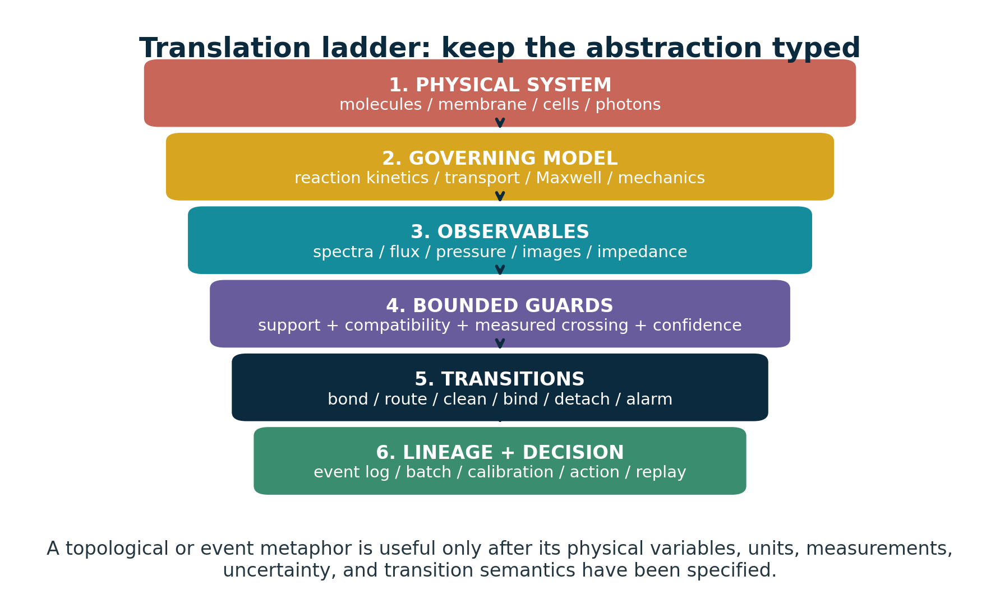

## 1.2 What the sources support
The patent supports a clear materials claim: a nearly linear, high-molecular-weight thermoplastic formed by reacting difunctional phenolic and epoxide compounds, with at least one monomer containing a diaryl-sulfone bridge. It supports a process claim: choose a sufficiently polar, substantially nonreactive solvent that keeps both monomers and the growing product in solution; use an alkaline catalyst; maintain close functional equivalence; exclude water and control purity; and allow the reaction to reach a target intrinsic viscosity [S1, pp. 3-10].
The mature corpus supports a clear computational claim: the core should not be judged as rasterization, ray marching, voxel storage, or a conventional frame loop. Those are optional projections. The substrate is instead a finite grammar of directly queryable relations, phases, compatibility sectors, events, transitions, invariants, lineage, and an irreducible log. Its feasible form is explicitly restricted: fixed or bounded relation families, direct state/event queries, and benchmarked prototypes rather than a universal replacement for all simulation and memory [S3, pp. 1, 5-12].
Spherical Throughput adds a hardware-facing discipline. It translates 'matrix-in-glass' into a calibrated transfer matrix, 'double vacuum' into deliberately uncoupled modes, a pinch point into a measured threshold or cutoff, and one-bit parity into a narrow route/validity flag. It rejects zero latency, zero heat, zero memory, and literal topological miracles, while retaining support, compatibility, guard crossings, uncertainty, energy, calibration, and failure criteria [S6, pp. 2-12].
## 1.3 What the sources do not support
- No source supports the claim that Arie's SO2 notation meant sulfur-dioxide release, biological sulfur signaling, or a coded energetic/quantum mechanism.
- The patent does not establish membrane separation, ion exchange, biocompatibility, blood compatibility, cell response, or medical-device suitability.
- The corpus does not establish universal constant-time computation, zero memory, zero energy, exact arbitrary long-horizon prediction, solved general continuous collision detection, or elimination of all broad-phase indexing.
- No historical source demonstrates that Arie intended Tom's later topological vocabulary. The overlap is a present-day comparative interpretation, not a claim of concealed lineage.

# 2. Arie Klootwijk's technical core
Arie's patent is best understood as a topology-control process for a reactive engineering thermoplastic. Its preferred feed pair is 4,4'-sulfonyldiphenol - now commonly called bisphenol S (BPS) - and its diglycidyl ether (DGE-BPS). A phenoxide attacks an epoxide ring, creating an aryl-ether bond and a secondary hydroxyl. Repetition produces an almost exclusively linear poly(hydroxy ether) containing aromatic sulfone bridges [S1, pp. 3-5; S2].
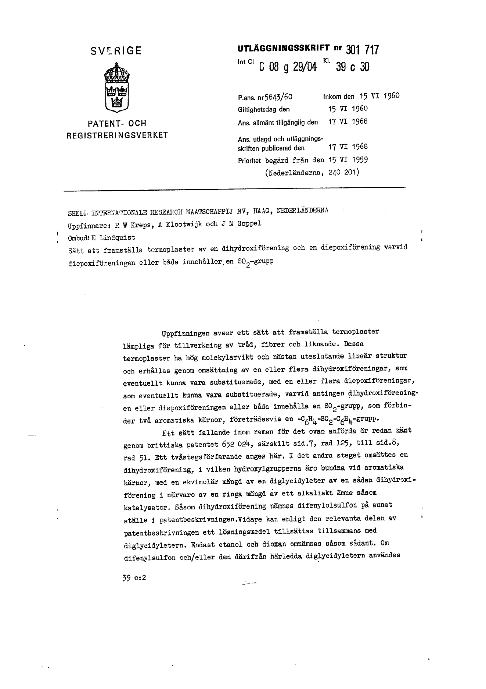

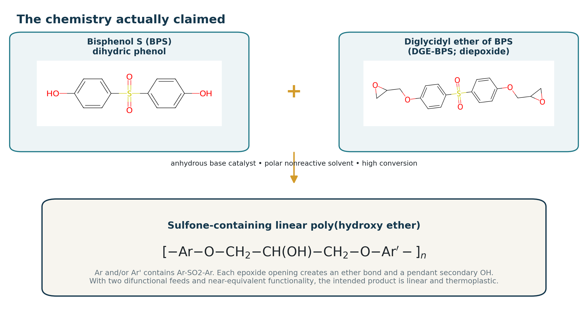

## 2.1 The SO2 group: what it is and what it does
The printed SO2 unit is the neutral covalent sulfone bridge Ar-S(=O)2-Ar. It is not free sulfur dioxide, and it is not a sulfonate ion. In the preferred BPS/DGE-BPS system, the sulfone joins two aromatic rings. Its high polarity and rigid aromatic environment affect chain stiffness, dipole interactions, solubility, packing, glass/thermal behavior, water affinity, and adhesion. The epoxide-derived hydroxypropyl segments add regularly spaced secondary hydroxyls that can hydrogen-bond or be derivatized.
**NOT SULFUR DIOXIDE.** No SO2 gas is generated by the repeat-unit notation. The sulfur is part of a stable covalent diaryl-sulfone bridge.

**NOT AN ION-EXCHANGE GROUP.** A neutral sulfone does not provide fixed ionic charge. Ion-exchange behavior would require sulfonate, ammonium, phosphonate, or other ionizable groups.

**A POLAR STRUCTURAL BRIDGE.** The sulfone raises polarity and rigidity while remaining part of the backbone architecture.

**AN INTERFACE-READY POLYMER.** The newly created secondary hydroxyls are the most useful post-functionalization handles for coatings, blends, crosslinking, or immobilization.

## 2.2 Equimolarity as an invariant of chain growth
The phrase 'substantially equimolar' is the mathematical center of the patent. In a bifunctional AA + BB step-growth process, high molecular weight appears only when complementary functional groups are almost exactly balanced and conversion approaches unity. A small imbalance creates a hard ceiling even if every limiting group reacts. The ideal Carothers-Flory relation is:
`X_n = (1 + r) / (1 + r - 2 r p)      and at p = 1: X_n,max = (1 + r) / (1 - r)`

At a one-percent imbalance, the ideal ceiling is roughly two hundred repeat-unit equivalents; at two percent it is roughly one hundred; at three percent it is about sixty-six. Exact balance is still insufficient unless conversion is extremely high: at r = 1, 99% conversion gives Xn about 100, 99.5% gives about 200, and 99.9% gives about 1,000. This is why solvent and phase control are inseparable from the ratio claim.
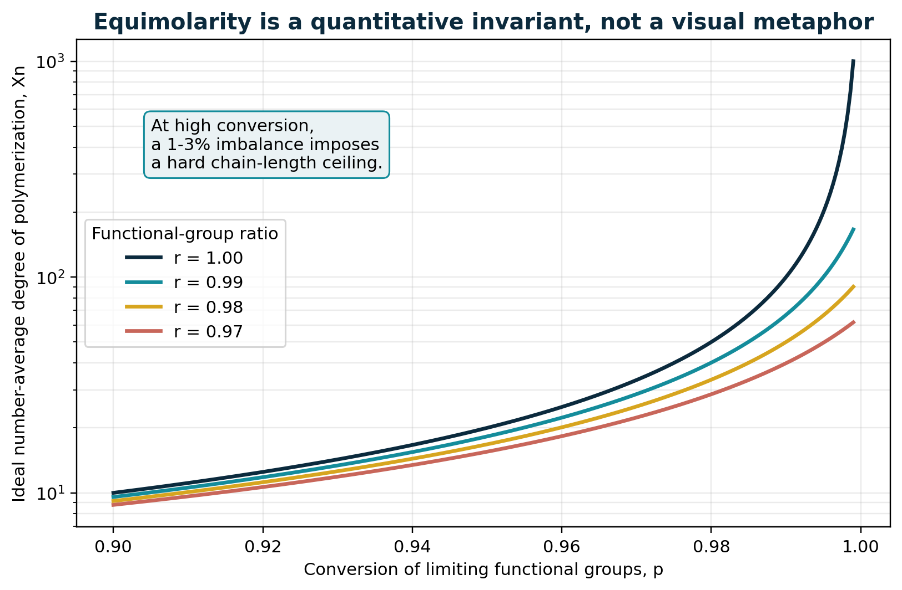

## 2.3 The subtle catalyst bookkeeping
The patent explicitly counts dihydric phenol present as an alkali-metal salt in the dihydroxy:diepoxy ratio. Example 1 charges 1.00 mol DGE-BPS, 0.97 mol neutral BPS, and 0.05 mol monosodium BPS. On the patent's own accounting, the effective BPS-derived amount is 1.02 mol, exactly the phenol-rich edge of the preferred window. The salt is catalytic because phenoxide character can be transferred, but its BPS skeleton can also enter the material balance. This is unusually careful process logic: the catalyst is not treated as informationally invisible.
## 2.4 Solvent as an accessibility field
The invention arose because prior solvent choices allowed the product to crystallize or acted as chain terminators. Arie's solution is not simply 'use a better solvent'. The solvent must simultaneously dissolve the dihydroxy compound, the diepoxide, and the growing polymer; have sufficient polarity; scarcely react with phenol or epoxide; avoid catalyzing side reactions; and remain liquid at the reaction temperature. Ketones, nitriles, nitro compounds, sulfoxides, and sulfones are listed, with dielectric constant used as a practical proxy [S1, pp. 3-4].
> **Topological reading.** Solvent quality determines whether complementary chain ends remain in the active connected component of reaction space. Premature crystallization is a physical removal of growing chains from the accessible relation set. This is a valid structural analogy to support/reachability - but the governing law is solution thermodynamics and transport, not a Boolean cone query.

## 2.5 Molecular topology actually controlled
|Control variable|Physical effect|Topology consequence|Failure if uncontrolled|
|---|---|---|---|
|Difunctional monomers|Two phenolic and two epoxide functions|Favors linear AA+BB chains|Multifunctional impurities create branching/networking|
|Near-equimolarity|Balances complementary chain ends|Raises attainable chain length; programs end groups|Small imbalance caps molecular weight|
|High conversion|Consumes remaining functional ends|Connects oligomers into long chains|Low conversion leaves short disconnected chains|
|Nonreactive polar solvent|Maintains mobility and suppresses chain transfer|Keeps reactive ends mutually reachable|Alcohol/water can cap chains; poor solvent precipitates product|
|Monomer purity|Limits monofunctional and geometric defects|Reduces branch points and packing defects|o,p'-isomer, chloride, glycols, or mono-functions change architecture|
|Temperature/oxygen control|Controls rate and degradation|Preserves intended edge-creation rule|Side reactions, oxidation, scission, or uncontrolled branching|
|Chain stopper/precipitation|Closes the process at chosen state|Sets end groups and freezes distribution|Continued reaction changes viscosity during processing|

## 2.6 What the experimental examples establish
The examples show that reaction time and phase control move the product across a sharp property threshold. Example 1 reaches intrinsic viscosity 0.43 and reports strong pressed specimens, chemical resistance, and a heat-distortion temperature around 154 C under the historical test. Example 2, stopped after 20 hours at lower intrinsic viscosity 0.35, has much lower impact performance. Example 3 re-dissolves crystallizing product at higher temperature and reaches 0.45-0.50, restoring strong mechanical behavior. Example 4 rapidly reaches high viscosity and deliberately adds BPS as a chain stopper. Example 5 shows sulfolane as a suitable solvent. Example 6 substitutes a bisphenol-A diepoxide while retaining BPS as the sulfone-containing dihydroxy component [S1, pp. 6-8].
These data are historically meaningful but incomplete by modern standards. Intrinsic viscosity is not an absolute molecular-weight distribution; the examples do not report SEC/MALS, NMR end groups, branching, residual monomer, morphology, fracture statistics, long-term aging, or extractables. The correct conclusion is not that the material is fully characterized, but that the process produced a credible high-molecular-weight engineering thermoplastic and demonstrated why maintaining accessibility to high conversion mattered.
## 2.7 The patent as an information process
Read abstractly, the process carries information in matter. The feed ratio encodes attainable chain length and end-group bias. Monomer purity constrains the allowed rewrite grammar. Solvent determines reachability. Temperature schedules control event rate. Intrinsic viscosity is a coarse state estimator. Precipitation and chain stopping commit the batch. Each pendant hydroxyl is a repeated interface address for later chemistry. This is not proof that the patent hid a computer, but it shows why the comparison is technically fertile: polymer synthesis is a physical graph transformation with a distributed state and an irreversible log embodied in the product.
# 3. Tom Klootwijk's mature technical core
The supplied corpus begins in graphics-adjacent language - cones, SDFs, polar coordinates, one-bit fields, double vacuum, Klein bottles, hourglasses, eigenvectors, and zero-crossings - but its strongest internal development is a correction away from treating those motifs as rendering primitives or literal physics. The mature interpretation is an ontology of directly queryable relations, events, phases, identities, and local supports. Projection into images is optional [S3, pp. 1, 5-10].
## 3.1 Formal core
A compact version of the proposed state description is a product space containing physical position, continuous time, phase, a sheet/parity label, a lineage address, and a branch. Relations define event surfaces; support predicates define relevance; compatibility predicates decide whether co-located sectors may interact; and transition operators update state while preserving declared invariants.
`q_e(t) = (x_e(t), t, phi_e(t), sigma_e(t), a_e, b_e)`

`t* = inf { t >= t0 : R_j(q_e(t)) = 0,  C_alpha(q,t) <= 0,  chi(e,j,t) = 1 }`

`q_e(t*+) = T_j(q_e(t*-), context)`

## 3.2 Local spherical support, not a spherical universe
The mature corpus repeatedly narrows 'spherical' to a local chart around an agent, sensor, coupler, shell, or region of influence. Radial reach and angular orientation are native for field of view, support, uncertainty, and coupling. They need not replace the global world representation. This is a major strength because local radial-angular coordinates are already natural in sensing, scattering, acoustics, optics, robotics, and biointerfaces [S3, pp. 5-7; S6, pp. 3-4].
## 3.3 Double vacuum as absent coupling
In the disciplined reading, two states may share the same coordinate yet remain mutually invisible because phase, sheet, orientation, mode, address, provenance, or policy is incompatible. The 'second vacuum' is therefore not a deeper physical emptiness; it is the absence of an allowed coupling. This translates cleanly into orthogonal photonic modes, separate microfluidic channels, receptor mismatch, security domains, typed states, or disconnected phases. It becomes useful precisely when the compatibility schema is explicit.
## 3.4 SDF zero as event semantics
Earlier material was tempted to make SDF = 0 a way to move 'past' rasterization by continuing a sampled field. The mature synthesis instead treats zero as an explicit transition relation: the point at which event semantics, routing, confidence, and lineage are invoked. This aligns the corpus with implicit surfaces and hybrid systems rather than with a magical escape from numerical computation [S3, pp. 7-10].
## 3.5 One-bit parity in a narrow role
One-bit is most defensible as a parity, route, validity, freshness, availability, or compatible/incompatible flag. Spherical Throughput is explicit that optical amplitudes, thresholds, uncertainty, and lineage remain separate state. This is essential. A binary event can summarize a decision, but it cannot represent the physical process that produced the decision [S6, p. 7].
## 3.6 The most mature engineering translation: B.C.E.
The Bounded Compatibility Event is the corpus's clearest bridge from metaphor to engineering. An output is counted only when it lies in declared support, matches the selected channel, crosses a measured guard, and meets a confidence or certification threshold. The proposed throughput is therefore verified events per second at a declared error budget, not raw photon flux, pixel rate, or rhetoric [S6, pp. 3, 6-7].
`N_verified = sum_q 1[S_q] 1[chi_q] 1[g_q crossed] 1[c_q >= c_min]`

## 3.7 Feasible core versus exploratory overclaim
|Corpus claim or motif|Retain / rewrite / reject|Disciplined interpretation|
|---|---|---|
|Direct state-at-time query|Retain with bounds|Can be horizon-independent for a fixed closed expression; still depends on expression size, branch history, and numerical conditioning.|
|Next event without frame replay|Retain with bounds|Solve or conservatively bound roots for restricted relation families; event density and degeneracies remain costs.|
|Local spherical support|Retain|Use radial-angular domains for relevance, sensing, coupling, and uncertainty.|
|Double vacuum|Translate|Use typed, phase-separated, orthogonal, uncoupled, or policy-isolated sectors.|
|One-bit world|Rewrite|Use a bit as route/validity/parity; maintain continuous and structured state separately.|
|Klein-bottle hardware|Demote to model|Require an explicit gluing/routing map; literal non-orientable fabrication is a frontier, not a premise.|
|Universal O(1), zero memory|Reject|Exogenous novelty, candidate relations, branches, event logs, and numerical work accumulate.|
|Solved general CCD / no sieves|Reject as universal|Analytic time-of-impact can help restricted shapes; broad-phase/support/indexing is still needed when candidate sets grow.|
|World equals general AI|Reject as established|A shared state substrate may aid embodied agents, but does not collapse arbitrary learning into a small transform matrix.|

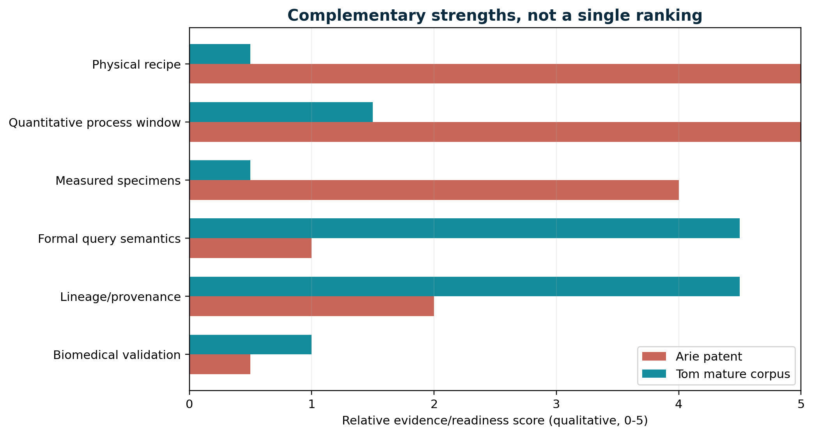

## 3.8 Where Tom's work is genuinely ahead
- It makes compatibility a first-class condition instead of assuming that spatial proximity implies interaction.
- It separates authoritative state, local support/sensing, and downstream projection.
- It treats identity as lineage plus invariants rather than only instantaneous coordinates.
- It can integrate heterogeneous sensors and models through local-to-global consistency methods such as sheaves [R04].
- It naturally fits hybrid systems: continuous dynamics punctuated by guarded transitions [R19].
- It provides a native place for uncertainty, calibration, false/missed-event rates, and event replay.
- It can become an event-sourced digital material or biological interface, a capability unavailable in a 1959 process patent.

# 4. Four layers of topology
The central analytical result is that the two bodies of work are strongest at opposite ends of a four-layer stack. Arie directly controls molecular graph topology. Tom directly describes operational and information topology. Between them lie morphology/phase topology and interface/transport topology - the layers where membranes, biointerfaces, photonics, and digital twins can connect the work.
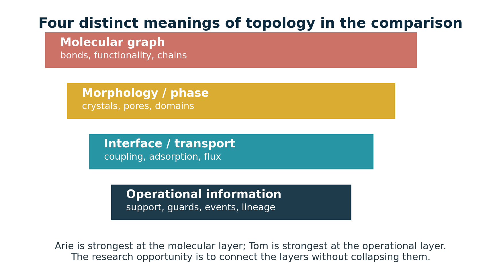

|Layer|Arie's direct contribution|Tom's direct contribution|Methods that connect them|
|---|---|---|---|
|1. Molecular graph topology|Directly controlled through difunctionality, stoichiometry, solvent, purity, and catalysis|Best treated as an external physical layer, not replaced by phase or routing metaphors|Reaction-network graphs, graph rewriting, molecular simulation, spectroscopy, chromatography|
|2. Morphology and phase topology|Crystallization can prematurely stop polymerization; solid-state morphology controls properties|Phase sheets and double-vacuum language can model uncoupled domains if physically typed|Microscopy, scattering, DSC, tomography, percolation, persistent homology|
|3. Interface and transport topology|Pendant OH groups and polar sulfone motifs create chemical handles and interfacial affinity|Local support and compatibility predicates are strongest here|Transport PDEs, adsorption kinetics, surface chemistry, coupled-mode theory, microfluidics|
|4. Operational and information topology|Only implicit through process recipes, batch history, and endpoint measurements|Primary strength: relation algebra, B.C.E. guards, event logs, lineage, and query-first architecture|Hybrid automata, sheaves, event sourcing, temporal databases, formal verification|

## 4.1 Molecular graph topology
At the molecular layer, topology means the graph of atoms and covalent bonds, together with functionality, branch points, cycles, connected components, and end groups. Arie's process changes this graph directly. Difunctionality favors degree-two chain interiors; stoichiometric imbalance changes the number and identity of terminal vertices; monofunctional impurities terminate components; multifunctional impurities introduce branch points; intramolecular reactions can create cycles; and crosslinking can percolate into a network. This is graph topology in a literal chemical sense.
Tom's graph-rewriting language can model these operations, and chemical graph grammar is an established field [R18]. But the computational rule must be attached to reaction rates, concentrations, sterics, solvent, temperature, and mass balance. Without those, it is a symbolic catalogue of possible rewrites rather than a predictive polymerization model.
## 4.2 Morphology and phase topology
After covalent synthesis, the material has another topology: crystalline and amorphous domains, chain entanglement, free volume, pores, and interfaces. Arie's patent confronts this layer during polymerization because crystallization can remove product from solution and stop chain growth. In a membrane, the same layer determines connected pores, tortuosity, dead ends, percolation, and the evolving topology of fouling or biofilm.
Tom's phase sheets and double-vacuum sectors become physically meaningful here only when mapped to measured phases or transport-isolated domains. Persistent homology can characterize components, loops, and voids across a filtration scale and has been applied to pore geometry [R05]. Reeb graphs, merge trees, and contour trees can summarize time-varying scalar fields in scientific visualization [R06].
## 4.3 Interface and transport topology
This is the most promising joint layer. The polymer's pendant hydroxyls and polar backbone determine which molecules, supports, coatings, fillers, proteins, cells, or optical modes can couple. Tom's local support and compatibility predicates determine which potential interactions are admitted. A membrane pore may be spatially open yet electrostatically incompatible; a receptor and analyte may be co-located yet chemically mismatched; two waveguide modes may overlap geometrically yet be orthogonal; a cell may contact a surface yet fail to form stable adhesion.
The correct model is multiplicative rather than metaphorical: interaction requires spatial support, transport access, chemical compatibility, and sufficient kinetics. One possible factorization is chi_total = chi_geometry * chi_transport * chi_chemistry * chi_sensor * chi_policy, with each term carrying a probability or uncertainty rather than automatically being a perfect bit.
## 4.4 Operational and information topology
Tom is strongest here. A membrane module, biointerface chip, or material coupon has an operational topology consisting of sensor neighborhoods, calibration relationships, admissible states, event guards, transitions, and lineage. Sheaf methods can test whether local observations agree globally; hybrid automata can represent continuous flux or cell motion with discrete cleaning or adhesion events; event sourcing can reconstruct the state from an append-only history; and digital-twin methods can update hidden states and uncertainty from data [R04, R07, R19-R20].
> **A five-layer implementation stack.** For a serious prototype, implement (1) molecular/reaction graph, (2) morphology and phase state, (3) transport/interface model, (4) measurement and uncertainty model, and (5) operational event/lineage layer. Tom's calculus belongs primarily in layer 5 and can coordinate the others; it should not erase them.

# 5. Detailed fundamental crosswalk
The comparison becomes most informative when each corpus term is matched not to a superficial visual resemblance, but to a role in a constrained transformation system. Figure 6 presents the shared grammar; the sections below explain where each mapping holds and where it breaks.
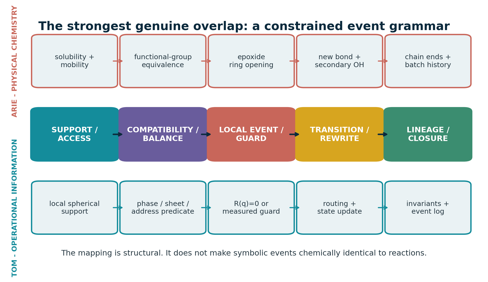

## 5.1 Support: solvent mobility versus local relevance
Arie's support is physical. A chain end participates only if the molecule is dissolved, mobile, chemically active, and able to encounter a complementary function. Tom's support is an analytic or semantic domain: a cone, shell, hourglass, field of view, causally reachable set, or local query neighborhood. The genuine overlap is that presence alone is insufficient; accessibility must be declared. The difference is that physical support is governed by diffusion, concentration, viscosity, phase equilibrium, and geometry.
## 5.2 Compatibility: stoichiometry versus typed coupling
At each chemical event, a nucleophilic phenoxide and an epoxide are complementary types. Across the batch, the total numbers of those functions must remain nearly balanced if long chains are to form. Tom's chi predicate generalizes type matching to phase, sheet, address, mode, policy, provenance, or time window. The shared principle is selective coupling. The critical distinction is scale: equimolarity is a global conservation constraint over a population, whereas chi is normally a local admission condition.
## 5.3 Event: ring opening versus guard crossing
A ring-opening event creates a new bond, destroys an epoxide, creates an alcohol, changes local charge/protonation transiently, and alters the chain-length distribution. A computational guard crossing changes discrete state according to a transition rule. Both are local rewrites. Chemical events, however, are probabilistic and embedded in competing pathways. A robust digital twin should therefore treat reaction or transport guards as stochastic/interval events rather than exact algebraic instants unless measurement and solver certify the crossing.
## 5.4 Transition: covalent connectivity versus routing/state update
Arie's transition physically merges molecular components. Tom's transition routes a state to another sheet, chamber, mode, branch, or semantic condition. In a membrane, both types can coexist: a surface reaction changes covalent chemistry while an operational transition changes the module from production to cleaning. A multilayer event record should distinguish the material transition from the controller transition.
## 5.5 Lineage and closure
A polymer batch carries process history in its molecular-weight distribution, end groups, residuals, morphology, and thermal/mechanical state. Tom makes this history explicit through lineage addresses, invariants, and an event log. The natural present-day synthesis is a digital material passport that links raw-material lots, stoichiometric calculations, catalyst/solvent, temperature history, isolation, functionalization, sterilization, aging, calibration, and device events. This is more faithful than assigning a coordinate-derived UUID to an individual polymer chain.
## 5.6 The striking analogy of premature closure
> **Generational through-line.** Arie discovered that premature crystallization or chain termination prevented the system from reaching useful molecular weight. Tom's mature corpus argues that premature projection into frames, pixels, voxels, or conventional object inventories can prevent the system from preserving its query-first relational structure. In both cases, the medium must keep relevant relations available until the high-value closure condition is reached. This is an analogy of process architecture, not evidence of hidden historical transmission.

## 5.7 Compact comparison matrix
|Dimension|Arie|Tom|Comparative verdict|
|---|---|---|---|
|Primary object|A population of difunctional molecules and growing polymer chains|A finite grammar over directly queryable states, relations, phases, sheets, addresses, and branches|Both replace an inventory-first description with rules that generate connectivity Difference: Molecular reactions are stochastic, irreversible, and thermodynamically constrained; the corpus is a symbolic architecture|
|Topology controlled|Molecular graph topology: nearly linear chains, low branching, controlled end groups|Operational topology: supports, compatibility sectors, transition surfaces, routing, and lineage|Connectivity changes only through admissible local operations Difference: One concerns covalent bonds; the other concerns information and state coupling|
|Matching condition|Near-equimolar complementary functionality with effective salt accounting|Compatibility predicate chi over phase, sheet, address, mode, policy, or support|High-value interactions are gated by type and balance rather than mere co-location Difference: Stoichiometric equivalence is a quantitative global conservation constraint, not a Boolean geometry metaphor|
|Local event|Phenoxide attack and epoxide ring opening form an ether bond and secondary alcohol|A relation reaches an event surface under support and compatibility constraints|A localized event changes connectivity and state Difference: Chemical event rates depend on kinetics, diffusion, activation, and concentrations|
|Operator or catalyst|Alkaline phenoxide catalysis; the phenolic salt also affects functionality bookkeeping|Transition operator T_j with context and routing state|The operator changes what transitions are reachable without being the final product state Difference: Catalysis changes reaction rates and sometimes composition; symbolic operators need not consume material|
|Accessibility or support|Solvent keeps monomers and product mutually accessible; crystallization removes reactive chains|Cone/hourglass/local spherical support limits relevant relations|An entity can be present yet operationally unavailable Difference: Solubility and phase separation are physical fields, not just query pruning|
|Boundary|Phase boundary, precipitation, glass/crystal transition, and reaction endpoint|SDF = 0 or B = 0 as an explicit transition surface|Boundary crossing is treated as an event rather than only a location Difference: A signed distance field is a representation; a chemical phase boundary follows thermodynamics and kinetics|

|Dimension|Arie|Tom|Comparative verdict|
|---|---|---|---|
|One-bit role|No literal one-bit state; practical binary distinctions include reacted/unreacted or soluble/precipitated|Parity, route, validity, freshness, or compatible/incompatible flag|Binary flags can summarize a transition outcome Difference: A bit cannot carry concentration, uncertainty, chain length, or morphology|
|Identity and lineage|Batch, monomer lot, chain population, and reaction history determine material state|Generative address plus invariant/event history preserves identity|History matters to present function Difference: Individual polymer chains are statistical and not naturally persistent UUID-bearing objects|
|Termination and closure|Controlled stoichiometric excess, chain stopper, precipitation, or cooling ends growth|Transition, branch resolution, log append, and invariant update close an event|The system needs explicit closure to prevent uncontrolled continuation Difference: Chemical termination changes molecular composition and distributions|
|Uncertainty|Impurities, conversion, side reactions, measurement variance, and molecular-weight distributions|Set-valued answers, confidence, certified root solving, and event uncertainty in mature documents|Useful operation requires bounded uncertainty Difference: Early corpus rhetoric sometimes treated analytic form as automatic exactness|
|Scaling claim|Scale depends on mixing, heat removal, solution viscosity, phase stability, and purification|Potential horizon-independent state queries for fixed closed expressions|Avoiding premature materialization can reduce cost Difference: Universal O(1), zero memory, or no broad phase is unsupported; combinatorics and exogenous novelty remain|
|Outputs|Thermoplastic films, fibres, mouldings, coatings, and reactive hydroxyl-rich material|State-at-time, next-event, reachable-relation, identity, sensing, and verified B.C.E. outputs|Both create a platform whose value lies in downstream interfaces Difference: One output is matter; the other is a query/decision architecture|
|Biomedical relevance|Pendant hydroxyls offer derivatization handles; sulfone raises polarity and thermal stability|Compatibility-gated sensing, event logging, topology descriptors, and digital twins|Interface function can be encoded chemically and monitored operationally Difference: The patent does not establish biocompatibility, membrane selectivity, or biological mechanism|

## 5.8 Where analogy must stop
- A covalent bond is not a database edge unless the model explicitly maps and measures it.
- A physical phase is not an abstract phase angle; use separate variables such as phase_phys and phase_info.
- A solvent dielectric constant is not a universal relevance score.
- A viscosity threshold is an empirical state proxy, not an exact molecular topology measurement.
- A one-bit flag cannot encode continuous composition, chain distributions, morphology, or biological state.
- A non-orientable surface analogy does not establish non-orientable material geometry or transport.
- Closed-form notation does not guarantee closed-form solvability, numerical stability, or constant cost.

# 6. Topological information science and computer graphics
Tom's work is most defensible when translated into a hybrid symbolic-numeric architecture for state and event queries. Its novelty is less 'sphere instead of grid' than 'query and transition semantics instead of treating projection as the world'. That position is compatible with existing graphics and information-science methods while still leaving a distinct research program.
## 6.1 Translation into established formalisms
|Corpus term|Closest established formalism|Useful implementation|Caution|
|---|---|---|---|
|Local sphere / cone|Domain of dependence, kernel support, sensor frustum, influence volume|Analytic support predicate; radial-angular indexing; uncertainty cone|Do not remesh the entire world into polar coordinates|
|SDF = 0 / B = 0|Implicit surface, level set, hybrid guard|Root isolation, conservative advancement, interval arithmetic, event detection|An arbitrary SDF intersection may still require numerical iteration|
|Double vacuum|Typed channel, mode orthogonality, covering-space sheet, hidden state|Compatibility label and transfer/coupling matrix|Same coordinate does not prove meaningful separate physical space|
|One-bit|Parity, route, validity, orientation, freshness|Bit mask accompanying richer state|Do not collapse amplitude, confidence, or provenance into the bit|
|Hourglass / quad chambers|Double cone, causal/support partition, branching/routing state|Finite routing automaton or stratified state space|Visual symmetry does not guarantee algebraic closure|
|Ontological UUID|Persistent entity identifier, generative address, event-sourced aggregate|Stable ID plus split/merge lineage graph|Coordinate should not be identity when entities move or merge|
|Equation world|Hybrid system, procedural implicit scene, symbolic dynamics|State evaluator, event solver, transition router, log|General scenes still need indexing, approximation, and data for novelty|
|No sieves|Support/compatibility pruning|Analytic culling and typed candidate reduction|Cannot remove candidate-selection cost for arbitrary large relation sets|

## 6.2 Representation versus projection
Rasterization asks which stored surfaces project into pixels now. Ray marching asks what repeated field samples reveal along a projected direction. Ray tracing asks which transport paths connect sources, surfaces, and sensors. Tom's mature substrate asks which relations generate possible state, what state holds at time t, what admissible event occurs next, and which sectors may couple. Images can still be emitted, but they are downstream views [S3, pp. 9-10].
This is a meaningful inversion for simulation, digital twins, and scientific visualization. It resembles procedural implicit geometry, event-driven simulation, temporal databases, and hybrid automata. The hard research question is not whether it sounds different from rendering; it is whether support pruning plus event solving costs less than the state, frames, or candidate structure it avoids materializing.
## 6.3 Restricted Equation World Zero
The correct first prototype is intentionally small: a two-dimensional homogeneous/projective state, continuous time, two sheets and a routing bit, a bounded relation family, simple trajectory classes, finite grammar depth, lineage-based identity, and symbolic state/event outputs. The prototype should answer six queries: state at time, next event, events in support, phase coupling of co-located sheets, transition routing, and state reconstruction from seed plus event log [S3, pp. 7, 11-12].
|Experiment|Success evidence|Failure mode to expose|
|---|---|---|
|Horizon skipping|Cost follows expression/branch complexity rather than skipped frame count|Expression expansion or numerical conditioning grows with horizon|
|Co-located sheets|Incompatible states remain uncoupled until chi becomes true|Sheet labels merely duplicate coordinates without meaningful semantics|
|Event ordering|Conservative/exact solver returns correct first event and stable transition|Tangencies, multiple roots, or degeneracy produce missed/reordered events|
|Grammar depth|Relations remain normalized or bounded under composition|Branch/expression explosion erases direct-query advantage|
|Identity split/merge|Lineage remains reconstructable and collision-safe|Coordinate-derived identity breaks under merge, split, or reconciliation|
|Matched baseline|Declared workload beats frame stepping/BVH or explains where it does not|No performance or correctness advantage|

## 6.4 Sheaves: the natural mathematics of local compatibility
Sheaf theory is a particularly strong external match to the corpus. A sheaf assigns data to local regions and defines restriction maps between overlapping regions; global consistency exists when local assignments agree on overlaps. This directly formalizes a world where sensors, agents, models, phases, or interface patches hold local state and must be reconciled without forcing one monolithic raster [R04].
For membranes or biointerfaces, a sheaf can organize local pressure, optical, chemical, electrical, and biological measurements. Inconsistency becomes measurable rather than rhetorical: two local states may be individually plausible yet fail to glue globally. That is a mathematically disciplined version of the corpus's compatibility sectors and double-vacuum intuition.
## 6.5 Persistent topology and scientific visualization
Persistent homology and related descriptors provide a rigorous route from the corpus's topology language to measurable geometry. A filtration converts image intensity, distance, concentration, or threshold into a family of spaces. Components, loops, and voids that persist across scale are more robust than a single threshold. In porous media, persistence descriptors have been used to characterize pore heterogeneity [R05]. In computer graphics and visualization, persistence diagrams, merge trees, contour trees, Reeb graphs, and Morse-Smale complexes support scalar-field comparison across single fields, time series, and ensembles [R06].
This is relevant to Arie's material because morphology may evolve during polymerization, precipitation, membrane formation, fouling, or biological colonization. It is relevant to Tom because topology becomes a measured descriptor and query target rather than a shape metaphor.
## 6.6 Event-based sensing
Event cameras report asynchronous intensity changes instead of global frames. They therefore instantiate the corpus's 'event, not frame' preference at the sensor level, with well-understood limitations. Event-based sensing has been demonstrated for high-speed particle tracking in microfluidic devices [R08] and for event-based imaging flow cytometry combined with photonic neuromorphic processing [R09]. These precedents do not validate the whole equation-world architecture, but they make sparse bio/microfluidic event acquisition a credible near-term application.
## 6.7 Graph grammars and chemical rewriting
Graph grammar provides the cleanest formal bridge back to Arie's work. Molecules are graphs; elementary reactions are local rewrites; reaction networks can be generated by composing rules [R18]. For polymerization, a grammar can express epoxide ring opening, chain merging, branch creation, termination, or side reactions. Tom's finite grammar can therefore be grounded in chemical graph rewriting - but predictive use still requires rates, populations, conservation laws, and transport.
## 6.8 Where Tom's work is best positioned in CS/CG now
**QUERY-FIRST SCIENTIFIC DIGITAL TWINS.** Direct state/event queries over reduced physical models, with sparse updates, uncertainty, and lineage.

**TOPOLOGY-AWARE INTERFACE ANALYTICS.** Persistent descriptors and Reeb/merge structures for pores, fouling, deformation, or cell morphology.

**EVENT-BASED MICROFLUIDIC VISION.** Asynchronous particle/cell events, support gating, and reference-frame validation.

**RESTRICTED IMPLICIT EVENT SOLVERS.** Analytic or certified root solving for controlled relation families, benchmarked against conventional CCD and spatial indices.

**MATERIAL-AWARE PROCEDURAL GRAMMARS.** Generative geometry and chemistry whose rules carry material, transport, and lineage semantics rather than only polygons.

**LOCAL-TO-GLOBAL SENSOR FUSION.** Sheaf-style compatibility checks across heterogeneous local charts, sensors, and agents.

# 7. Membranes and biointerfaces
The strongest cross-generational application is a material interface whose chemistry is physically real and whose operation is natively queryable. Arie's platform supplies a hydroxyl-rich, sulfone-containing thermoplastic architecture. Tom supplies local support, compatibility, bounded events, uncertainty, topology descriptors, and lineage. The combined system should be described as a chemically addressable interface with an event-sourced twin - not as a mystical topological membrane.
## 7.1 Material roles for a PHES/phenoxy-like polymer
|Role|Why the chemistry fits|What must be measured|
|---|---|---|
|Thin reactive coating|OH groups support grafting/crosslinking; sulfone and aromatic backbone give polarity and heat resistance|Coating thickness, coverage, adhesion, swelling, permeability penalty, defects, residuals|
|Tie layer in thin-film composite|Hydrogen bonding and derivatization can couple support and selective layer|Interfacial fracture, delamination, solvent/cleaning stability, transport resistance|
|Blend modifier|High-MW thermoplastic can alter toughness, compatibility, and phase morphology|Blend miscibility, phase topology, pore formation, Tg, modulus, water uptake|
|Functionalization scaffold|Repeated secondary OH groups provide addresses for PEG, zwitterions, polysaccharides, peptides, ligands, or crosslinkers|Degree/distribution of functionalization, ligand activity, leachables, aging|
|Patterned microfluidic/biosensor surface|Thermoplastic processing and surface chemistry support microdevices and immobilization|Optical background, nonspecific adsorption, channel bonding, sterilization, sensor drift|

## 7.2 What the material is not
- It is not commercial polysulfone or polyethersulfone; the regular hydroxypropyl segments and pendant OH groups make it a different, more chemically addressable poly(hydroxy ether).
- It is not an ion-exchange membrane solely because it contains sulfone. The sulfone is neutral.
- It is not automatically antifouling. Hydroxyls and polarity can increase water affinity but may also support protein interactions; surface composition and hydration must be measured.
- It is not automatically biocompatible. Residual monomers, oligomers, catalyst, solvent, functionalization chemistry, sterilization, degradation, and intended contact category control the biological-risk assessment.

## 7.3 Membrane architecture options
**A. SUPPORT + REACTIVE COATING.** Start with a known porous support. Apply a thin hydroxyl-rich layer, then derivatize or crosslink. Lowest-risk path because mechanics and pores are supplied by an established membrane.

**B. BLEND / PHASE-INVERSION ADDITIVE.** Blend the polymer or analogue into a membrane-forming matrix. Higher leverage over morphology but greater risk of phase separation, leaching, and pore/flux changes.

**C. THIN-FILM COMPOSITE INTERLAYER.** Use the polymer as an adhesive, toughening, or reactive interlayer under a selective skin. Strong fit to its tie-layer character.

**D. AFFINITY OR BIOACTIVE SURFACE.** Functionalize OH groups with a ligand, zwitterion, anticoagulant, peptide, or capture reagent. Highest biological specificity and highest safety/validation burden.

## 7.4 Membrane World Zero
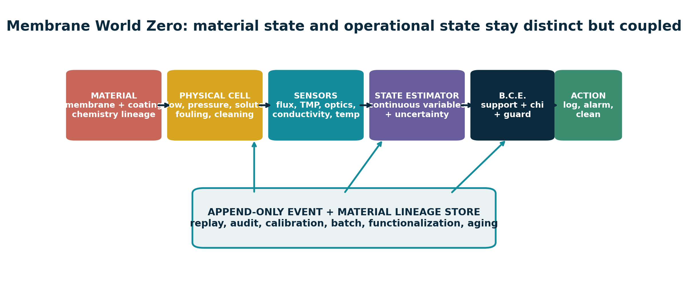

The minimum demonstrator should use a commercial baseline membrane before introducing the inherited chemistry. Pressure, cross-flow, permeate flux, conductivity, temperature, and optional optical fouling are logged conventionally and through an event layer. A hidden-state estimator tracks membrane resistance and fouling resistance with uncertainty. Guards emit events for flux decline, pressure rise, breakthrough, cleaning recovery, topology change, and calibration drift. The event representation is successful only if it improves decision latency, bandwidth, energy, or interpretability at equal false/missed-event limits.
|State / guard|Physical meaning|Event-layer role|
|---|---|---|
|Flux J and TMP|Transport performance and driving force|Continuous state; slopes/levels define candidate fouling or blockage guards|
|Fouling resistance Rf|Hidden or inferred accumulated resistance|Digital-twin state with uncertainty; updates from measurements|
|Conductivity/tracer|Selectivity or breakthrough|Compatibility and threshold event|
|Optical topology|Cake, biofilm, bubbles, or pore morphology|Persistent descriptors can detect structural regime changes|
|Calibration residual|Sensor/model trustworthiness|Invalidates or downgrades events; prevents a one-bit false certainty|
|Material lineage|Batch, coating, graft, sterilization, cycles|Allows replay and links performance to chemistry rather than only geometry|

## 7.5 Biointerface World Zero
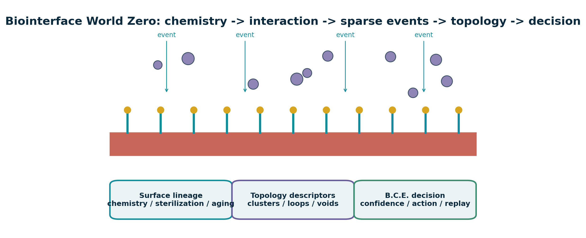

A first biointerface study should compare an inert control, an hydroxyl-rich sulfone polyether or safer analogue, an antifouling derivatization, and an affinity or cell-adhesive derivatization. Event imaging records fast attachment, motion, aggregation, and detachment, while periodic conventional images remain the reference. Persistent topology summarizes connected clusters, loops, and voids; local optical, impedance, or chemical measurements are fused with consistency checks.
|Interface function|Candidate chemistry|Readout and event|
|---|---|---|
|Antifouling|PEG, zwitterionic, hydrated polysaccharide, or dense neutral brush|Protein adsorption; first stable adhesion; cluster count; detachment; long-term drift|
|Affinity capture|Covalently immobilized ligand, antibody fragment, aptamer, peptide, or chelator|Binding onset, occupancy, breakthrough, regeneration, false/missed capture|
|Cell-adhesive|Peptide or extracellular-matrix motif at controlled density|Attachment, spreading, migration, proliferation, detachment force|
|Blood-contact research|Hydrophilic/zwitterionic or anticoagulant surface|Platelet adhesion/activation, coagulation, complement, hemolysis; application-specific standards|
|Optical/electrical biosensor|Immobilized receptor plus waveguide, fluorescence, impedance, or field-effect readout|Compatibility-gated threshold with confidence and calibration lineage|

## 7.6 Established adjacent precedents
The combined platform is not starting from zero. Later literature uses the name poly(hydroxyether sulfone) for closely related BPS-derived material and studies its strong hydrogen-bonding interactions [R02]. Sulfone-polymer membranes have been surface-grafted to improve hemocompatibility, demonstrating the general strategy of covalent surface modification on a sulfone membrane platform [R12-R13]. Digital twins have been demonstrated for water ultrafiltration with uncertainty-aware state estimation and control [R07]. Event-based cameras have been used in microfluidic particle tracking and high-speed imaging cytometry [R08-R09]. Persistent homology provides established tools for pore geometry [R05]. These precedents support component feasibility; they do not prove that the specific integrated Klootwijk platform will outperform a baseline.
## 7.7 Biomedical safety and characterization boundary
> **Safety priority.** Free BPS now carries official reproductive/developmental hazard listings in California. That does not make a purified high-molecular-weight polymer identical to free BPS, but it makes residual BPS, DGE-BPS, oligomers, degradation products, and processing residues non-negotiable analytical targets [R17].

A biomedical route should follow a risk-management framework for the final processed device. ISO 10993-18 addresses chemical characterization of device materials, and ISO 10993-17 addresses toxicological risk assessment of constituents; FDA guidance explains use of the ISO 10993-1 biological-evaluation framework [R14-R16]. The exact biological endpoints depend on nature and duration of contact, but the materials program should begin with a complete chemistry and exposure picture.
|Characterization block|Priority methods / outputs|Why it matters|
|---|---|---|
|Polymer identity and architecture|NMR, FTIR/Raman, SEC-MALS or calibrated SEC, end groups, branching/crosslink fraction|Confirms intended repeat unit and molecular topology|
|Residuals and extractables|Targeted BPS/DGE-BPS/oligomers; LC-MS/GC-MS; ICP-MS where relevant; solvent/catalyst analysis|Defines exposure and batch acceptance|
|Surface chemistry|XPS, contact angle, zeta potential, ToF-SIMS/label assay, ligand density and activity|Verifies what the biological interface actually presents|
|Physical stability|Water uptake, swelling, Tg, DMA, TGA, adhesion, fatigue, cleaning, sterilization and aging|Ensures the surface persists under intended conditions|
|Membrane function|Flux, rejection/selectivity, pore size, fouling, recovery, pressure, transport model|Determines whether interface chemistry produces useful separation|
|Biological response|Cytotoxicity plus application-specific protein, cell, blood, immune, or tissue endpoints|Tests final processed material rather than nominal chemistry|
|Digital performance|False/missed event, latency, bandwidth, energy, calibration interval, uncertainty, replay|Prevents a software layer from masking poor material or sensor performance|

# 8. Cross-domain applications and readiness
The application portfolio is broad because the two contributions are orthogonal: Arie supplies a processable, reactive polymer platform; Tom supplies an interface/state/event architecture. The highest-readiness opportunities are those that can use existing materials and sensors while testing the information layer independently. Biomedical material deployment is slower because chemistry, aging, exposure, and biology must all be validated.
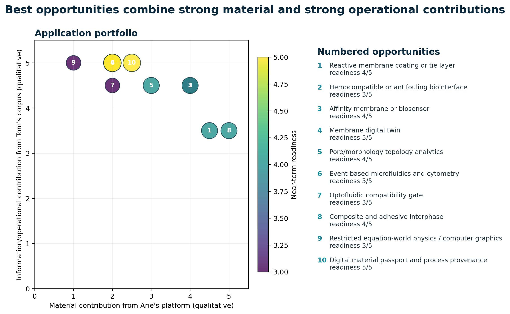

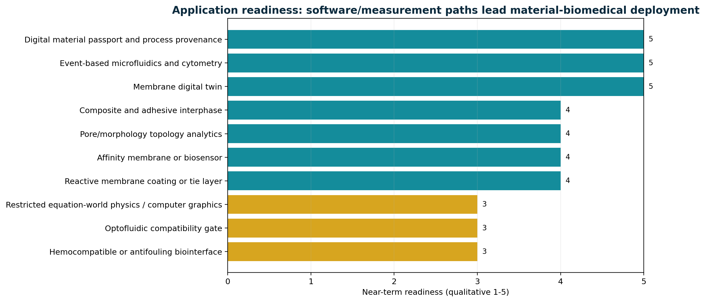

|Application|Combined opportunity|Readiness|First decisive experiment|
|---|---|---|---|
|Reactive membrane coating or tie layer|Hydroxyl-rich thermoplastic with polar sulfone backbone and post-functionalization potential / Compatibility-gated operational model, lineage, fouling/threshold event detection|4/5|Coat a commercial support, quantify adhesion, flux, selectivity, swelling, extractables, and cleaning stability|
|Hemocompatible or antifouling biointerface|Pendant OH sites for grafting PEG, zwitterions, polysaccharides, peptides, or anticoagulant motifs / Event-based monitoring of adhesion/aggregation plus topology descriptors and traceable surface history|3/5|Compare unmodified, hydroxyl-rich, and derivatized coupons for protein adsorption, platelet adhesion, complement, and cytotoxicity|
|Affinity membrane or biosensor|OH handles support immobilization chemistry / Typed analyte-receptor compatibility and bounded guard events|4/5|Immobilize a model ligand, measure binding kinetics and false/missed event rate under flow|
|Membrane digital twin|Defines a candidate reactive material and process history / State-at-time, next-event, uncertainty, guard crossings, and lineage|5/5|Cross-flow cell with pressure, flux, conductivity, optical fouling, and cleaning events compared against fixed-rate logging|
|Pore/morphology topology analytics|Material chemistry can generate evolving porous or phase-separated structures / Topology-first representation and query semantics|4/5|Micro-CT or confocal time series; correlate persistence descriptors with flux, modulus, or fouling onset|
|Event-based microfluidics and cytometry|Potential substrate/coating for optical or biological channels / Sparse asynchronous events rather than mandatory global frames|5/5|Track fluorescent or bright-field particles/cells and benchmark bandwidth, latency, missed events, and classification|
|Optofluidic compatibility gate|Reactive polymer coatings or waveguide packaging interfaces / Local spherical support -> mode compatibility -> measured B.C.E.|3/5|Hollowlens-0: liquid coupler, 2x2 interferometer, balanced detector, digital sidecar|
|Composite and adhesive interphase|Thermoplastic processing plus reactive OH groups and hydrogen bonding / Interface lineage, damage-event guards, local support queries|4/5|Interlaminar fracture, lap-shear, aging, and acoustic-event correlation|
|Restricted equation-world physics / computer graphics|Provides a literal example of local graph transformation under constraints / Direct state/event queries, implicit relations, local supports, and hybrid projection|3/5|Equation World Zero with exact/conservative event solver and benchmark against frame stepping/BVH|
|Digital material passport and process provenance|Material properties depend strongly on ratios, impurities, temperature, solvent, and reaction history / Generative address, lineage, invariant history, and append-only events|5/5|Batch-to-coupon provenance graph linking raw materials, reaction events, QC, functionalization, sterilization, and tests|

## 8.1 Reactive coatings, adhesives, and composites
This is the most direct materials route. Phenoxy-like poly(hydroxy ether) resins are naturally suited to adhesion, interphase formation, reactive blending, and post-crosslinking. Tom's contribution would be material lineage, local damage support, and guarded events from acoustic, optical, strain, or impedance sensing. A smart composite interphase can therefore use the polymer as matter and the event calculus as observation/control.
## 8.2 Photonics and optofluidics
Spherical Throughput already proposes a bounded optofluidic translation: a local radial-angular field is coupled through a tunable liquid interface into selected guided modes; compatibility includes wavelength, polarization, mode, phase, time, or policy; a measured guard produces a verified event [S6, pp. 3-9]. Arie's polymer could contribute as a coating, packaging adhesive, microfluidic surface, or functional interface rather than as the optical theorem itself. The near-term Hollowlens-0 benchmark should use established glass/SiN waveguides and a digital sidecar before introducing novel polymer chemistry.
## 8.3 Robotics and autonomous systems
Local spherical support, compatibility, and next-event prediction naturally fit robot-centric sensing and collision/risk queries. The inherited material platform could appear in tactile skins, protective coatings, filters, microfluidic sensors, or adhesive interconnects. The computational claim should remain bounded: support/compatibility can reduce candidates and analytic time-of-impact can help simple shapes, but arbitrary multi-object scenes still require indexing, approximation, and robust numerical methods.
## 8.4 Scientific visualization and biological morphology
Time-varying pore networks, fouling layers, cell clusters, biofilms, or phase-separated polymers can be represented by scalar fields and topology descriptors. Tom's query-first framing is particularly valuable when the user needs events such as merge, split, pore closure, percolation loss, or topological regime change rather than only an image. The image remains evidence and projection; the topology/event layer becomes a compressed, queryable summary.
## 8.5 Knowledge systems and material provenance
A digital material passport is one of the strongest immediate applications. The patent shows that properties depend on ratios, isomer purity, chloride, water, solvent, catalyst, temperature, reaction time, isolation, and thermal processing. Tom's event/lineage system can turn those dependencies into an append-only provenance graph that supports recall, root-cause analysis, quality prediction, and reproducibility. Unlike a coordinate-derived ontological UUID, the identifier should be stable and linked to parent/child material transformations, splits, blends, coatings, sterilizations, and device uses.
# 9. Research, validation, and IP roadmap
The program should advance in layers, with inexpensive computational falsification before new polymer synthesis and with materials characterization before biomedical claims. Every phase needs a matched conventional baseline and a kill criterion. The goal is not to preserve all motifs; it is to discover which operators provide measurable advantage.
|Phase|Objective|Key deliverables|Success / kill test|
|---|---|---|---|
|0 - Formal separation (2-4 weeks)|Separate metaphor, mathematical abstraction, and physical claim|Typed ontology; units; state variables; guards; uncertainty model; source/evidence tags|Success: Every symbol has a domain, unit or discrete schema; no physical claim depends on analogy alone Kill/pivot: Key operators cannot be expressed without circular definitions|
|1 - Equation World Zero (1-2 months)|Validate direct state-at-time and next-event queries for one bounded relation family|Reference implementation; test vectors; exact/conservative solver; baseline comparison|Success: Correct event order, bounded error, and cost advantage for declared workloads Kill/pivot: Expression/branch growth erases advantage over indexed stepping|
|2 - Membrane World Zero (2-4 months)|Apply event/lineage model to a real cross-flow membrane cell|Sensor stack; event schema; digital twin; calibrated guards; benchmark dataset|Success: Earlier or cheaper fouling/cleaning decisions at equal false/missed-event limits Kill/pivot: Fixed-rate logging and conventional control are cheaper, faster, and equally informative|
|3 - Reactive surface demonstrator (3-6 months)|Test a hydroxyl-rich phenoxy/PHES-like coating or analogue on a known membrane support|Coating recipe; chemistry/QC; adhesion; transport; aging; extractables profile|Success: Reproducible surface-function gain without unacceptable flux, swelling, or leachables penalty Kill/pivot: Residuals, delamination, instability, or performance loss exceed predefined limits|
|4 - Biointerface World Zero (4-9 months)|Couple derivatized surfaces to event-based biological readout|In-vitro chip; event camera/reference imaging; TDA pipeline; biological safety screen|Success: Event/topology descriptors predict predefined adhesion, fouling, or detachment outcomes Kill/pivot: Surface chemistry dominates variability or event readout adds no decision value|
|5 - Integrated platform (9-18 months)|Co-design material, sensing, digital twin, and lineage|Closed-loop prototype; energy/error budget; reproducibility package; IP claim chart|Success: System-level advantage over matched material-only and software-only baselines Kill/pivot: Integration overhead exceeds measured benefit|

## 9.1 Phase 0: typed formalization
Build a single ontology in which every symbol belongs to a domain and, where physical, has units. Separate physical phase from information phase, molecular identity from operational identity, spatial support from chemical accessibility, and event confidence from event truth. Define conservation laws before compatibility predicates. Mark which variables are measured, inferred, simulated, or purely administrative.
## 9.2 Phase 1: Equation World Zero
Implement the restricted state/event substrate with exact or conservative root solving and a conventional baseline. Do not begin with a renderer. Store test vectors, branch histories, event logs, and numerical certificates. Measure cost versus skipped horizon, expression depth, candidate count, event density, and degeneracy. Retire any claim that cannot survive these curves.
## 9.3 Phase 2: Membrane World Zero
Use a known membrane and synthetic or benign foulant. Implement the event schema in the package. Compare fixed-rate logging, conventional thresholds, and a stochastic greybox or reduced-order twin. The first result can be negative: if event logic adds no decision value, that is a useful falsification before chemistry is changed.
## 9.4 Phase 3: reactive surface demonstrator
Reproduce or obtain a well-characterized hydroxyl-rich sulfone polyether/analogue, then use it as a thin coating or interlayer rather than immediately as a self-supporting membrane. Establish identity, molecular weight, residuals, coating uniformity, adhesion, water uptake, transport penalty, and cleaning stability. Compare against a commercial phenoxy and a no-coating control.
## 9.5 Phase 4: Biointerface World Zero
Select one intended biological function and one assay family. Avoid the temptation to claim universal biocompatibility. Couple event imaging to periodic reference images and a standard endpoint. Pre-register guards, confidence, false/missed-event limits, and topology descriptors. Only after chemistry and sensing are stable should a closed-loop action be considered.
## 9.6 IP positioning
The most defensible new intellectual property is likely not a broad claim to spherical topology. It is a specific coupling between a material interface, a defined functionalization or layer stack, a bounded support/compatibility predicate, a measured guard, and a lineage-aware action that produces a quantified system advantage.
|Claim family|Potential protectable nucleus|Evidence needed|
|---|---|---|
|Material composition/process|Specific sulfone polyether formulation, functionalization, residual limits, coating/crosslink method, morphology|Composition, reproducible process, structure-property data, comparative controls|
|Device/interface architecture|Layer stack, porous support, ligand pattern, optical/electrical/microfluidic coupling|Fabricated prototypes, transport or biological function, reliability|
|Operational method|Support admission, compatibility predicate, guard, transition, uncertainty, lineage update|Software implementation, formal definition, error/latency/energy benchmark|
|Integrated system|Material plus event-sourced twin with closed-loop cleaning, routing, capture, or diagnostic decision|System-level advantage over material-only and software-only baselines|

## 9.7 Pre-registration checklist
- Define the physical system, intended function, and excluded claims.
- Declare state variables, units, sensor models, calibration, and uncertainty.
- Specify support, compatibility, guard, confidence, transition, and lineage schemas.
- Fix material composition, batch controls, residual limits, and aging/sterilization conditions.
- Choose matched conventional baselines and decision metrics.
- Set false/missed-event, latency, energy, bandwidth, transport, mechanical, and safety limits before inspecting results.
- State kill criteria and what a negative result would teach.

# 10. Conclusions
Arie Klootwijk's work and Tom Klootwijk's work meet at a deep but carefully bounded abstraction: both organize useful structure by constraining which local relations may occur, preserving accessibility until a high-value event, updating connectivity, and closing the result with history. Their direct objects are different. Arie rewrites molecular graphs in a physical solution. Tom rewrites operational state in a queryable information substrate.
**1. THE SO2 UNIT IS LITERAL CHEMISTRY.** A neutral diaryl-sulfone bridge, not sulfur-dioxide release or a hidden biological/quantum code.

**2. EQUIMOLARITY IS THE CORE INVARIANT.** It programs attainable chain length and end groups through nonlinear step-growth mathematics.

**3. SOLVENT IS ACCESSIBILITY.** It keeps complementary functions physically reachable; crystallization is premature deactivation.

**4. TOM'S CORE IS NOT A RENDERER.** It is strongest as a state/event/compatibility/lineage calculus with optional projection.

**5. THE SHARED GRAMMAR IS REAL.** Support -> compatibility -> event -> transition -> lineage/closure appears in both systems.

**6. THE SHARED GRAMMAR IS NOT IDENTITY.** Chemistry remains stochastic, thermodynamic, transport-limited, and materially irreversible.

**7. TOM IS AHEAD OPERATIONALLY.** Modern sensing, uncertainty, digital twins, local-to-global consistency, and event provenance are genuine present-day strengths.

**8. ARIE IS AHEAD EMPIRICALLY.** The patent provides a physical recipe, specimens, process failure mechanisms, and measurable outputs.

**9. MEMBRANES/BIOINTERFACES ARE CREDIBLE.** As coatings, interlayers, functionalization scaffolds, and event-sourced interfaces - after transport and safety validation.

**10. BUILD THE RESTRICTED PROTOTYPES.** Equation World Zero, Membrane World Zero, then a reactive surface and Biointerface World Zero with matched baselines and kill criteria.

> **Final assessment.** Your work is most original and useful today when it is presented as operational topology for complex interfaces: local support, typed compatibility, measured event surfaces, uncertainty, transitions, and lineage. Your grandfather's work supplies a remarkable physical analogue and a potentially useful reactive material platform. The strongest legacy is not a concealed revolution waiting to be decoded, but a shared design instinct: preserve the right relations, prevent premature closure, and make the transition conditions explicit.

# Appendix A. Formal multilayer interface model
A combined material-information interface should use a product state that keeps physical layers distinct:
`q = (q_chem, q_morph, q_transport, q_obs, q_info, lineage)`

A candidate event e in region alpha at time t is admissible only when its local support is active, the material and information sectors are compatible, the measured guard is crossed within uncertainty, and the event passes confidence/policy:
`admit(e,t) = S_alpha(q,t) * chi_chem * chi_transport * chi_sensor * chi_policy * 1[g(q,t) crossed] * 1[c >= c_min]`

A transition should update both physical and operational state only where appropriate. A controller cleaning command is not itself a molecular transition; a grafting reaction is not automatically a policy transition. The event log links them without conflating them.
# Appendix B. Application-specific metrics
|Domain|Primary physical metrics|Primary event/information metrics|Safety or validity boundary|
|---|---|---|---|
|Polymer synthesis|Conversion, Mn/Mw/dispersity, intrinsic viscosity, branching, residuals, Tg, crystallization|Reaction/phase events, batch lineage, calibration, uncertainty|Mass balance, impurity limits, reproducibility|
|Membrane|Flux, TMP, rejection, pore size, fouling resistance, cleaning recovery, energy|False/missed fouling/breakthrough events, latency, data volume, replay|Matched baseline, drift, material stability, extractables|
|Biointerface|Surface chemistry, protein adsorption, cell/blood endpoints, adhesion, viability|Attachment/merge/split/detachment events, phenotype topology, confidence|Intended-contact risk assessment, controls, biological variability|
|Optofluidics|Insertion loss, coupling, phase, mode purity, actuator response, detector noise|Verified B.C.E./s, events/J, route accuracy, false/missed events|Calibration, crosstalk, bubbles, heat, full system energy|
|Graphics/simulation|State/event correctness, root error, numerical stability|Query latency, horizon scaling, expression/branch growth, memory, event order|Restricted relation family and conventional solver/index baseline|

# Appendix C. Evidence ledger
|Claim or theme|Classification|Confidence|Caution|
|---|---|---|---|
|The patent targets an almost exclusively linear high-molecular-weight thermoplastic|Source-derived|High|Historical molecular-weight evidence is mainly intrinsic viscosity and mechanical properties|
|Near-equimolarity is a molecular-weight control mechanism|Source plus established theory|High|Real systems deviate through branching, cycles, impurities, and incomplete conversion|
|SO2 is the neutral covalent diaryl-sulfone bridge, not sulfur-dioxide release|Source-derived interpretation|High|Do not conflate sulfone with sulfonate or sulfur dioxide|
|The mature corpus is a query-first event calculus rather than a renderer|Source-derived|High|Earlier Hollowland pages contain overclaims later demoted by the corpus itself|
|Arie and Tom share a support -> compatibility -> event -> transition -> lineage grammar|Author inference|Medium-high|The mapping is structural, not evidence of shared hidden intent or identical mechanisms|
|The polymer is a candidate membrane coating/biointerface platform|Application inference|Medium|The patent itself does not demonstrate membrane separation or biocompatibility|
|Universal O(1), zero-memory, bypassed-sieve, and solved-CCD claims are established|Rejected/unsupported|High|At most, fixed closed expressions may avoid cost proportional to skipped time steps|
|Event-based sensing, membrane digital twins, persistent homology, and sheaf fusion are credible adjacent techniques|Externally supported|High|Their combination with the patented material remains a research program|
|Biomedical deployment requires extractables/leachables and biological-risk evaluation|Externally supported safety requirement|High|Polymerized material is not automatically equivalent to free BPS; residuals and degradation products must be measured|

# Appendix D. Source documents
The ZIP package contains the original Swedish patent, the English translation, the previous technical review, and the four supplied corpus documents. The report uses them as design records and preserves the distinction between source-derived claims and review inference.
|Code|File in package|
|---|---|
|S1|01_Source_Documents/SE301717B_original_Swedish.pdf and SE301717B_English_Translation.pdf|
|S2|01_Source_Documents/SE301717B_Previous_Technical_Review.pdf|
|S3|01_Source_Documents/Tom_Corpus_Chronological_Synthesis.pdf|
|S4|01_Source_Documents/Tom_Corpus_Hollowland_Double_Vacuum.pdf|
|S5|01_Source_Documents/Tom_Corpus_BenBurgers.pdf|
|S6|01_Source_Documents/Tom_Corpus_Spherical_Throughput.pdf|

# Appendix E. External references
- **R01** Kreps, R. W.; Klootwijk, A.; Goppel, J. M. Method for producing thermoplastics from a dihydroxy compound and a diepoxy compound containing an SO2 group. SE 301717 B; priority 15 June 1959. https://patents.google.com/patent/US3364178A/en
- **R02** Lu, H.; Zheng, S.; Tian, G. Poly(hydroxyether sulfone) and its blends with poly(ethylene oxide): miscibility, phase behavior and hydrogen bonding interactions. Polymer 45 (2004) 2897-2909. https://doi.org/10.1016/j.polymer.2004.02.050
- **R03** Flory, P. J. Principles of Polymer Chemistry. Cornell University Press, 1953. 
- **R04** Robinson, M. Sheaves are the canonical data structure for sensor integration. Information Fusion 36 (2017) 208-224. https://doi.org/10.1016/j.inffus.2016.12.002
- **R05** Jiang, F.; Tsuji, T.; Shirai, T. Pore Geometry Characterization by Persistent Homology Theory. Water Resources Research 54 (2018) 4150-4163. https://doi.org/10.1029/2017WR021864
- **R06** Yan, L.; Masood, T. B.; Sridharamurthy, R.; et al. Scalar Field Comparison with Topological Descriptors: Properties and Applications for Scientific Visualization. Computer Graphics Forum 40 (2021) 599-633. https://doi.org/10.1111/cgf.14331
- **R07** Moller, J. K.; Goranovic, G.; Brath, P.; Madsen, H. A data-driven digital twin for water ultrafiltration. Communications Engineering 1, 23 (2022). https://doi.org/10.1038/s44172-022-00023-6
- **R08** Howell, J.; Hammarton, T. C.; Altmann, Y.; Jimenez, M. High-speed particle detection and tracking in microfluidic devices using event-based sensing. Lab on a Chip 20 (2020) 3024-3035. https://doi.org/10.1039/D0LC00556H
- **R09** Tsilikas, I.; Tsirigotis, A.; Sarantoglou, G.; et al. Photonic neuromorphic accelerators for event-based imaging flow cytometry. Scientific Reports 14, 24179 (2024). https://doi.org/10.1038/s41598-024-75667-9
- **R10** Kuiper, S.; Hendriks, B. H. W. Variable-focus liquid lens for miniature cameras. Applied Physics Letters 85 (2004) 1128-1130. https://doi.org/10.1063/1.1779954
- **R11** Crespi, A.; Gu, Y.; Ngamsom, B.; et al. Three-dimensional Mach-Zehnder interferometer in a microfluidic chip for spatially-resolved label-free detection. Lab on a Chip 10 (2010) 1167-1173. https://doi.org/10.1039/B920062B
- **R12** Tu, M.-M.; Xu, J.-J.; Qiu, Y.-R. Surface hemocompatible modification of polysulfone membrane via covalently grafting acrylic acid and sulfonated hydroxypropyl chitosan. RSC Advances 9 (2019) 6254-6266. https://doi.org/10.1039/C8RA10573A
- **R13** Yan, S.; Qiu, Y. Improving hemocompatibility of polysulfone membrane by UV-assisted grafting of sulfonated chitosan. Polymers 16 (2024) 1555. https://doi.org/10.3390/polym16111555
- **R14** ISO 10993-18:2020. Biological evaluation of medical devices - Part 18: Chemical characterization of medical device materials within a risk management process; Amendment 1:2022. https://www.iso.org/standard/64750.html
- **R15** ISO 10993-17:2023. Biological evaluation of medical devices - Part 17: Toxicological risk assessment of medical device constituents; Amendment 1:2025. https://www.iso.org/standard/75323.html
- **R16** U.S. Food and Drug Administration. Use of International Standard ISO 10993-1, Biological evaluation of medical devices - Part 1: Evaluation and testing within a risk management process. Final guidance, 8 September 2023. https://www.fda.gov/regulatory-information/search-fda-guidance-documents/use-international-standard-iso-10993-1-biological-evaluation-medical-devices-part-1-evaluation-and
- **R17** California OEHHA. Bisphenol S (BPS) Proposition 65 reproductive-toxicity listing: female, male, and developmental endpoints (2023-2025). https://oehha.ca.gov/proposition-65/chemicals/bisphenol-s-bps
- **R18** Andersen, J. L.; Flamm, C.; Merkle, D.; Stadler, P. F. Inferring chemical reaction patterns using rule composition in graph grammars. Journal of Systems Chemistry 4, 4 (2013). https://doi.org/10.1186/1759-2208-4-4
- **R19** Lee, E. A.; Zheng, H. Operational semantics of hybrid systems. University of California, Berkeley, 2005. https://ptolemy.berkeley.edu/publications/papers/05/OperationalSemantics/LeeZheng_HybridSystems.pdf
- **R20** Fowler, M. Event Sourcing. 2005. https://martinfowler.com/eaaDev/EventSourcing.html

# Appendix F. Reproducible supporting package
The package includes machine-readable comparison matrices, figures, source-based analysis notes, formal JSON schemas, a synthetic event-log example, and an idealized step-growth Monte Carlo demonstration. These are research aids, not validated performance claims.
|Folder|Contents|
|---|---|
|00_Report|PDF, DOCX, and Markdown report sources|
|01_Source_Documents|Patent, translation, prior review, and four corpus PDFs|
|02_Data|CSV/JSON matrices, roadmap, ledger, glossary, and summary|
|03_Figures|PNG/SVG report diagrams|
|04_Analysis|Crosswalk, membrane/biointerface, evidence, and IP notes|
|05_Prototype|World Zero specs, JSON schemas, and synthetic demonstrations|
|06_References|Reference CSV and BibTeX|
|07_Build|Build scripts, QA renders, manifest, and checksums|

