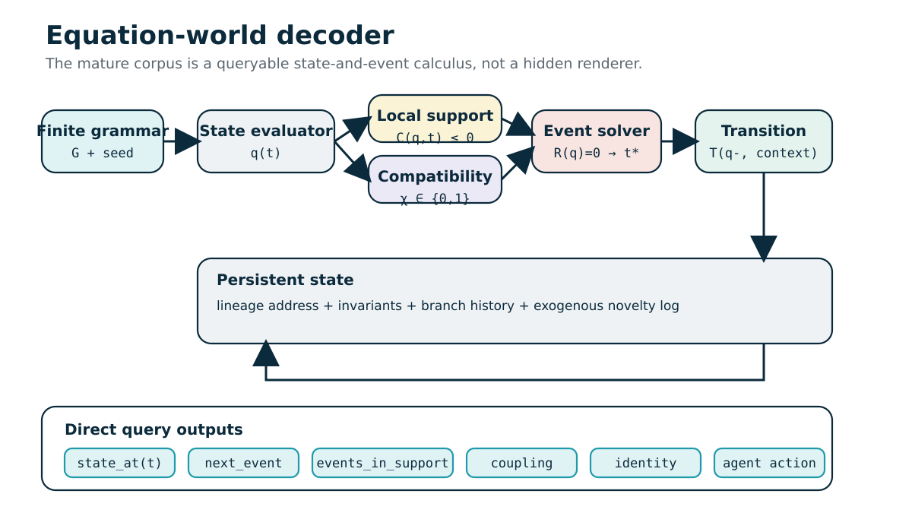

# Decoded Alchemical Corpus
## Executive finding

The corpus's mature core is a **spherical-support event calculus**: finite grammar, phase-layered state, local radial-angular support, compatibility, event solving, transition routing, lineage and an exogenous novelty log. The most technically grounded hardware extension is Hollowlens-0, a bounded optofluidic waveguide demonstrator.

The package does not treat metaphor as evidence. Standard molecular and biological structures are added only where the documents identify a real object unambiguously.

# Method and Evidence Rules

## Objective

Convert recurring alchemical prose into explicit technical objects without pretending that metaphor is measurement or that a named scientific term supplies missing equations, molecular sequences or material parameters.

## Five evidence layers

1. **Source-defined operator** - a concept is explicitly stabilized by the mature corpus, such as local spherical support, compatibility, event surface, parity or lineage.
2. **Established science** - standard mathematics, physics, chemistry or biology introduced to clarify a named term, such as a Klein bottle, DMT molecular graph, Maxwell equation or CRISPR-Cas9 mechanism.
3. **Bounded engineering proposal** - a coherent but unvalidated implementation path, especially Hollowlens-0.
4. **Decoder inference** - a constructive mapping that is plausible but not uniquely forced by the prose.
5. **Unsupported, incorrect or fictional claim** - rhetoric, category error, factual mistake or narrative material that must not be converted into a scientific assertion.

Every table row in the package carries one of these statuses or a close variant.

## Extraction rule

The mature corpus itself gives the crucial rule: interpret “sphere,” “cone,” “double vacuum,” “Klein bottle,” “one-bit” and “hourglass” as computational variables, local charts, compatibility sectors, gluing rules and routing bits unless the text supplies a literal physical model.

## Chemistry rule

A molecular structure is generated only when the corpus identifies a chemical species unambiguously. DMT, water and glycerol meet that threshold. “Optical oil,” “liquid crystal,” “protein,” “virus,” “blood plasma” or “gene” do not identify a unique molecule or sequence; they receive schematics and constraints, not invented atomistic coordinates.

## Biology rule

No therapeutic, genomic or BCI claim is upgraded from metaphor to mechanism. A valid biological model needs species, sequence, concentrations, kinetics, transport, delivery, uncertainty and experimental validation.

## Geometry rule

Topological motifs are separated from metric and material claims. A Klein bottle may define an orientation-reversing gluing map; it does not automatically create a fabricable waveguide, vacuum, collision shield or globally signed SDF.

## Complexity rule

“No frame replay” is not “universal O(1).” Complexity includes expression growth, root solving, compatibility evaluation, event density, branching, numerical conditioning and memory for parameters/logs/calibration.

## Deliverable rule

Each generated structure is labeled as one of:

- **source reconstruction** - direct formalization of a stabilized corpus operator;
- **standard scientific annotation** - external grounding of a named term;
- **illustrative schematic** - not a unique recovered structure;
- **3D conceptual mesh** - geometry for inspection, not fabrication proof.

---

# Master Synthesis

## Decisive result

The documents contain one coherent technical line and many speculative extensions.

The coherent line is a **spherical-support event calculus**:

1. a finite grammar and seed describe closed dynamics;
2. a state manifold includes position, time, phase, sheet, lineage address and branch;
3. local radial-angular supports admit only relevant relations;
4. compatibility predicates decide whether sectors may couple;
5. event surfaces define potential transitions;
6. a root/event solver finds the next valid crossing;
7. transition functions route state while preserving declared invariants;
8. lineage and an exogenous novelty log support persistence and reconstruction;
9. images, meshes and pixels are optional downstream projections.

## What “spherical” actually means

It means local radial/angular organization around a sensor, coupler or entity: reach, orientation, shell, field of view and uncertainty. It does not mean every physical, semantic and computational structure should be stored globally as a sphere.

## Strongest actual implementation

The bounded hardware line is an optofluidic photonic device:

`angular/radial input → liquid tuning → guided-mode coupling → compatibility → measured guard → verified event`

This is modeled with Maxwell electromagnetics, Young-Laplace capillarity, coupled-mode theory, optional Navier-Stokes dynamics, overlap integrals and digital event logic.

## What is not actually recovered

- no hidden universal chemistry;
- no secret protein fold or gene sequence;
- no new physical vacuum;
- no literal topological shield;
- no general exact solver for chaos;
- no universal 64-bit AI/world representation;
- no zero-power or zero-memory hardware;
- no BCI mechanism for remote bodily control or retroactive nullification.

## Falsifiable core

The architecture succeeds only if the cost of support pruning, compatibility and event solving grows more slowly than the explicit world structure or frame history it avoids materializing, while meeting the same error and uncertainty boundary.

---

# Geometry and Topology Decode

## Local support geometry

The package reconstructs the corpus’s “sphere” as a local chart. A point or relation is admitted when it lies inside a radial/angular support. The support can model field of view, causal reach, collision relevance, memory retrieval or mode acceptance.

## Implicit surfaces and events

An SDF or general implicit relation defines a scalar field. The zero level set is the boundary. In the mature architecture, crossing zero invokes event semantics only after support and compatibility pass.

The event rule is therefore not `sample until d≈0`; it is conceptually:

`find earliest t where relation=0 AND support=true AND compatible=true`.

## Phase sheets and double vacuum

A phase sheet is a discrete label attached to state. Two states with the same spatial coordinate can remain uncoupled because their sheet, phase, orientation, mode or lineage tags are incompatible. This is the technical content of “double vacuum.”

## Hourglass

The hourglass is best understood as a finite routing partition. Four chambers can encode two sheet states crossed with two route/orientation states. The central pinch is the transition locus. The vertical axis is an invariant reference, not mystical geometry.

## Klein bottle and Möbius strip

Both are non-orientable surfaces. The Möbius strip has one boundary component; the Klein bottle is closed. They motivate orientation-reversing gluing and parity, but a 3D Klein bottle visualization self-intersects and is not a leak-proof physical container.

## Overlap lens

The two-D/φ slight overlap is represented as the intersection of two disks. It can encode shared domain, mutual information, clearance or interference. No unique physical law follows from the shape alone.

## 3D assets

- `local_sphere.obj`
- `double_cone_hourglass.obj`
- `mobius_strip.obj`
- `klein_bottle_immersion.obj`

These are conceptual meshes, not manufacturing models.

---

# Chemistry and Biochemistry Decode

## Molecular structures actually identifiable

### N,N-Dimethyltryptamine

The source identifies DMT by name but uses it metaphorically. The decoder supplies the standard molecular structure: an indole aromatic heterocycle carrying a two-carbon side chain terminating in a tertiary dimethylamine.

Files include 2D SVG, MOL/SDF connectivity, a generated 3D conformer, SMILES and metadata. The 3D conformer is one calculated geometry, not a unique biological conformation.

### Water and glycerol

The bounded optofluidic report explicitly lists water/glycerol mixtures as candidate liquid regions. Their molecular files are included. Their relevance is material: polarity, hydrogen bonding, viscosity, refractive index and wetting.

### What cannot be uniquely reconstructed

No exact molecule can be generated for “optical oil,” “liquid crystal,” “protein,” “blood plasma,” “virus,” “gene” or “cell.” These names cover families or systems. Inventing a unique atomistic file would be false precision.

## Gene expression

The real biochemical flow is DNA/chromatin regulation → RNA production/processing → translation → protein folding/modification/degradation. The source’s phase/eigenvalue language does not specify a biochemical controller.

## CRISPR-Cas9

Guide RNA directs Cas9 to a DNA target under sequence and PAM constraints. Cleavage is followed by cellular repair. The source is correct at this headline level, but its dismissal of laboratory practice and its proposed algebraic replacement are unsupported.

## Protein structure

Proteins occupy conformational ensembles. Sequence, solvent, ligands, modifications and kinetics matter. The source’s “vibrating grammar” is a useful anti-snapshot metaphor but not an atomistic folding algorithm.

## Reaction-diffusion and transport

Reaction-diffusion equations are a real bridge from the corpus’s field language to chemical patterning. For biological fluids, an advection-diffusion-reaction equation is more appropriate than “phase sheets” alone.

## Viral entry

The package corrects the claim that spike proteins puncture a human cell wall. Human cells have plasma membranes. Virus-specific entry commonly involves receptor binding, protease activation and membrane fusion or endocytosis.

## Safety boundary

No medical, genomic or BCI intervention is validated by these documents.

---

# Optics, Photonics and Optofluidics Decode

## Optical front end

The corpus’s aperture, cone, lighthouse and spherical field language can be converted into a bounded angular/radial input domain.

## Log-polar representation

`ρ=ln r` makes radial scale changes additive. This can support foveated or multiscale indexing and simple approximations to scale-like chromatic shifts. It is not distortion-free and requires origin handling.

## Camera obscura

The pinhole inversion is real geometric optics. The “inward soul” interpretation is metaphor. The practical variables are aperture size, propagation distance, wavelength, diffraction and detector response.

## Waveguide realization

The most concrete device is Hollowlens-0:

- stable solid waveguide platform;
- liquid overclad or lens;
- phase/coupling actuator;
- 2×2 interferometer;
- balanced photodiodes;
- digital calibration and event sidecar.

## Physics stack

- Maxwell: optical field;
- Young-Laplace: liquid-interface curvature;
- coupled-mode theory: guided amplitudes;
- Navier-Stokes: transient liquid motion if needed;
- overlap integral: coupling efficiency;
- B.C.E.: measured event declaration.

## Measurement

Spherical throughput is verified events per second, not raw photon flux. Full-system energy, loss, latency, drift, missed events and false events are mandatory.

## Fabrication boundary

The later source’s fabrication sequence is conventional: waveguide formation, microfluidic cavity, liquid/actuator, bonding/sealing, optical coupling, photodiodes/ADC and calibration. Literal Klein-bottle hardware remains frontier.

---

# Computational Architecture Decode

## State instead of image

The mature proposal treats a world as directly queryable relations rather than a sequence of pictures. Rendering remains possible but downstream.

## Hybrid event system

The closest established computer-science category is a hybrid dynamical system with:

- continuous state trajectories;
- implicit guard surfaces;
- discrete modes/sheets;
- compatibility predicates;
- transition/reset maps;
- invariants;
- event and novelty logs.

## Direct queries

`state_at(t)` can skip replay for closed-form or compiled trajectories. `next_event` solves for the earliest supported compatible crossing. Neither query is universally constant-time.

## Identity and lineage

A generative address and parent/transition history can preserve identity across coordinate changes. The corpus’s 64-bit UUID claim is too absolute; real systems need collision policy, namespaces and split/merge semantics.

## Memory

Seed + grammar + exogenous log can reduce snapshot storage. Memory remains necessary for coefficients, branch history, external events, calibration and numerical state.

## Acceleration structures

BVHs, octrees and raster grids are not “wrong.” They are conventional candidate-pruning/materialization methods. Analytic support and compatibility are alternatives. Only workload-specific benchmarks can decide which wins.

## Signal/display bridge

KC Vector Art proposes log-polar SDF geometry followed by one-bit pulse density or spatial dithering. This can be a downstream output stage without making pixels the underlying ontology.

## Undefined element

“Feynman vectors” need a formal state/measure/accumulation definition before they can be considered an algorithm.

---

# Claims, Corrections and Non-Claims

## Explicitly retained

- local radial/angular support;
- relation and event surfaces;
- compatibility gating;
- parity/routing bits;
- lineage and invariants;
- bounded event queries;
- optofluidic waveguide prototype;
- verified-event metrics.

## Explicitly rejected or demoted by the mature corpus

- universal O(1);
- zero memory;
- zero latency;
- zero heat or zero power;
- literal double vacuum;
- physical Klein-bottle proof;
- exact chaos;
- universal AI compression;
- medical or biological control;
- replacement for every renderer and PDE solver.

## Additional decoder corrections

- DMT chemistry is not encoded by metaphor; use the standard molecular graph.
- Human viral entry is not spike puncturing a cell wall.
- Opossum venom resistance is not universal immunity.
- Microsaccades are not binary search.
- Bee temporal vision is not a fixed “FPS.”
- Hard-sphere atoms are a model approximation.
- Golden ratio is not automatic stabilization.
- A 1:1 arch ratio is not a universal accretion-disk law.
- Vector orthogonality cannot create physical untouchability.
- BCI/telepresence sovereignty passages are unsupported narrative, not mechanism.

The full row-by-row analysis is in `data/claims_evidence_matrix.csv`.

---

# Prototype Blueprints

## Digital-first Equation World Zero

### Minimum relation family

- 2D or 3D position plus continuous time;
- two sheet labels;
- one route/parity bit;
- analytic trajectories from a restricted family;
- one or two implicit relations;
- local cone support;
- compatibility predicate;
- lineage identifier and append-only event log.

### Required queries

1. `state_at(t)`
2. `next_event(t0)`
3. `events_in_support`
4. `phase_coupling`
5. `transition_route`
6. `reconstruct_identity`

### Success criteria

- correct event ordering;
- no missed crossings within declared tolerance;
- expression growth bounded or normalizable;
- query cost tied to expression complexity rather than skipped frames;
- stable split/merge lineage;
- interval or uncertainty output near degeneracy.

## Hollowlens-0

### Minimum hardware

- one angularly scanned source;
- one tunable liquid coupler;
- one 2×2 interferometric waveguide;
- two balanced detectors;
- one FPGA/MCU sidecar.

### Pre-registration

Fix wavelength, optical power, support sector, compatible modes, thresholds, uncertainty, error targets, energy boundary, calibration interval and electronic baseline before viewing results.

### Kill criteria

Stop or redesign if optical loss, liquid instability, crosstalk, drift, actuation speed, event ambiguity, packaging or digital-sidecar overhead erase the claimed advantage.

---

# Source-by-source analyses

# ADDominUS

## Role in the corpus

ADDominUS is a large exploratory extension that applies the equation-world vocabulary to gene expression, CRISPR, protein folding, identity, hardware, batteries, manufacturing, power plants, plasma, blood plasma, food, BCI, bodily sovereignty and waveguides. It contains useful prompts but also the corpus's most severe overclaims and safety-sensitive narratives.

The later **Spherical Throughput** report explicitly treats ADDominUS as a source of manufacturing prompts, not validation.

## Useful recoverable content

### Computational architecture

The document restates several mature ideas:

- state/event queries instead of mandatory frame replay;
- finite grammar plus exogenous log;
- lineage-based identifiers;
- phase/sheet compatibility;
- guard surfaces;
- direct event solving;
- potential memory savings by regenerating closed dynamics.

These remain engineering hypotheses until implemented and benchmarked.

### Photonics and manufacturing

The valuable hardware vocabulary includes:

- etched-glass or silicon-photonic waveguides;
- liquid overclad, liquid core or deformable input lens;
- interferometric transfer matrices;
- mode compatibility;
- threshold/dark-port events;
- balanced detection;
- microfluidic fabrication and packaging.

The later bounded report converts these into Hollowlens-0 with Maxwell, coupled-mode theory, Young-Laplace, optional Navier-Stokes, overlap integrals and a digital control sidecar.

### Industrial digital twins

The idea of mapping thermal, pressure, flow or electrical limits as analytic guards is reasonable for a hybrid system. “Next-fault” queries are meaningful if the dynamics and uncertainty are validated. Claims of instantaneous long-horizon certainty are not.

## Biology and chemistry

### CRISPR

The source correctly names guide RNA and Cas9-mediated DNA cutting, but it caricatures modern laboratory work as a simple string search followed by blind injection. Actual genome editing includes target/PAM design, delivery, repair outcomes, off-target analysis and experimental validation. No replacement biochemical method is supplied.

### Protein folding

The source is right that proteins are dynamic ensembles and that flexible regions may matter. It is wrong to imply a general exact, instantaneous procedural-grammar solution without a sequence-dependent energy model and benchmarks.

### Gene expression

The proposal to “power down φ” or alter eigenvalues to reduce gene-expression mistakes is unsupported. Gene expression is a biochemical network involving DNA/chromatin, transcription, RNA processing/turnover, translation, modification and degradation. No molecular target or intervention is specified.

### Blood plasma

A continuous flow/transport model is a legitimate representation. “Tethering plasma to an eigenvector” is not a therapeutic mechanism. The package translates the prose into velocity, pressure, concentration and boundary variables only.

### Food calories

The document's “caloric creation” passages are logistics/yield-optimization metaphors. Algorithms can optimize growth, harvest and routing; they do not create chemical energy without physical inputs and metabolism/photosynthesis.

## Unsupported hardware claims

Specific claims such as entire AI models in 64 bits-2 KB, million-entity worlds under 32 MB, microwatt universal inference, zero heat, elimination of EUV lithography and exact fusion control are not derived. The later source rejects zero latency, heat, power, memory and universal O(1).

## BCI, telepresence and bodily-control passages

Pages 26-36 present phase separation, ghost shields, retroactive nullification and physical untouchability as responses to unwanted bodily occupation or telepresence. No credible neurophysiological, electromagnetic, computational or medical mechanism is supplied. These passages must be treated as narrative boundary/sovereignty metaphors, not evidence that remote bodily occupation is occurring and not a treatment design.

## Social/identity language

“Ontological UUID,” “architect,” “keys” and “structural sovereignty” can be decoded as data provenance and personal-boundary metaphors. Orthogonal vectors and null spaces cannot physically erase people, history or contact.

## Page anchors

Biology/CRISPR/protein: pp. 2-6. Identity, lineage and memory: pp. 7-11. Domain warping/security metaphors: pp. 12-18. Batteries/manufacturing/chips: pp. 18-25. BCI/sovereignty narratives: pp. 26-36. Energy/plasma/industrial twins/blood/food: pp. 36-47. Waveguide and manufacturing prompts: pp. 47-65.

---

# 21 Ben Burgers Strikes Back

## Role in the corpus

This document moves from zero-based indexing into a pun-driven geometry of φ-like shapes, torque, double arches and overlap. It also surfaces the Benjamin-Bona-Mahony-Burgers (BBMB) equation through a search-result association.

## Actual computer-science content

`21+7+7=35`. In zero-based indexing, index 35 is the 36th element. This is an ordinal/addressing distinction, not altered arithmetic. A bit shift does not turn 35 into 36: left and right shifts multiply or divide by powers of two under language-specific integer rules.

## Geometric content

A lowercase φ or two D-like lobes can be idealized as circles/semicircles sharing a stem. A slight overlap creates a lens-shaped intersection `A∩B`. That region can legitimately represent:

- shared spatial domain;
- mutual information/common membership;
- mechanical clearance or interference;
- wave superposition region, if amplitudes and phases are defined.

The package includes `phi_overlap_lens.svg`.

## Torque and warping

Torque is a vector tendency to rotate. Torsional deformation of a non-circular section can include warping, but the document does not provide geometry, material, constitutive law or boundary conditions. Consequently, its claims that a split oval necessarily unfolds into a sine wave or that a central zero is a protected hinge are conceptual illustrations, not derived mechanics.

## BBMB equation

The scientifically grounded equation associated with the title is:

`U_t + U_x + U U_x - m U_xx - U_xxt = 0`

It combines advection, nonlinearity, dissipation and BBM-type dispersion in a one-dimensional wave model. The source document itself does not derive this PDE or connect it to its two-D overlap. The package includes it as external grounding, clearly labeled.

## Unsupported astrophysics claim

The assertion that two arches must overlap in an exact 1:1 ratio to prevent a warped accretion disk from tearing is unsupported. Warped-disk behavior depends on torque distribution, viscosity or bending-wave propagation, disk thickness and boundary conditions; there is no universal π:π stability rule.

## Page anchors

Zero indexing and astronaut story: pp. 1-9. φ/torque/oval: pp. 10-12. Accretion-disk double arches: pp. 13-15. Folded φ/D overlap and interpretation: pp. 16-19.

---

# Chronological Synthesis of the Spherical Substrate Line

## Role in the corpus

This is the most important internal decoder. It changes the reading rule from “an unusual renderer” to “a queryable relation, state and event system.” It explicitly says that rasterization, ray marching, voxel storage and frame loops are downstream projection techniques, while the proposed substrate is built from relations, events, phases, identities and compatibility.

## Recoverable technical core

The document’s strongest formulation is:

- a finite grammar generates a continuous or piecewise-continuous state manifold;
- local spherical/radial-angular supports select relevance;
- relations define implicit event surfaces;
- compatibility gates decide whether co-located sectors may interact;
- transition functions update state at event times;
- lineage and invariants preserve identity across coordinate changes, splits and merges;
- an exogenous log stores novelty that cannot be regenerated from the grammar.

The state-space notation is summarized by `Q = P^n × R_time × S_phase × Z2_sheet × A_address × B_branch`. An entity trajectory is augmented with phase, sheet, lineage address and branch. An event is the earliest root that simultaneously lies inside a support and passes a compatibility predicate.

## Geometric translation

| Corpus image | Technical reading |
|---|---|
| sphere / shell | local support, radial reach, orientation, uncertainty |
| cone | domain of relevance, influence or sensing |
| hourglass | routing partition around a transition locus |
| SDF=0 / B=0 | guard or event surface |
| one-bit | parity, route or validity flag |
| double vacuum | co-location without coupling |
| ontological address | lineage-based identity |

The document repeatedly corrects the “polar-everything” interpretation. Spherical coordinates are a local chart, not a universal remeshing of the world.

## Feasibility boundary

The document narrows the defensible claim to restricted relation families that can answer `state_at(t)` and `next_event` without replaying every frame. It explicitly demotes universal O(1), zero memory and world-equals-general-AI claims to hypotheses. It also identifies algebraic closure, event density, branch explosion, degeneracies, numerical conditioning, exogenous entropy, split/merge identity and semantic grounding as the real bottlenecks.

## Best prototype

“Equation World Zero” is a small hybrid event system with two sheets, one orientation/parity bit, a bounded relation family, simple trajectories, finite grammar depth, lineage and symbolic outputs. The recommended experiment is headless: test state queries, event ordering, compatibility, routing and persistence before building a renderer.

## Files in this package

- `structures/geometry/equation_world_pipeline.svg`
- `structures/geometry/local_spherical_support.svg`
- `structures/geometry/phase_sheet_double_vacuum.svg`
- `structures/geometry/sdf_event_surface.svg`
- `structures/geometry/quad_hourglass.svg`
- `data/equations_and_operators.csv`
- `data/claims_evidence_matrix.csv`

## Page anchors

Executive interpretation: pp. 1-2. Unified concept and equations: pp. 5-7. Complexity and numerical stability: pp. 8-9. Comparison with rendering: pp. 9-10. Risks, experiments and final decision: pp. 11-12.

---

# DMT / Leeuwenhoek / Animalcules / Optics Narrative

## Role in the corpus

This is the broadest alchemical-prose document. It weaves Dutch microscopy history, lenses, radiation, art, camera obscura, Möbius surfaces, biological vision, jitter, reaction-diffusion, fictional viruses, geopolitics and surveillance into one metaphorical field.

The document contains real optics and biology terminology, but it does **not** encode a uniquely recoverable secret molecular or biochemical theory. The package therefore separates standard science from metaphor and error.

## DMT chemistry

The title names N,N-dimethyltryptamine as a metaphorical “gateway” to hidden reality. The prose does not specify atoms or bonds. The decoder adds the standard neutral molecular graph:

- formula: `C12H16N2`
- scaffold: indole ring system
- side chain: two-carbon linker at the indole 3-position
- terminal group: tertiary dimethylamine
- dominant bonding: covalent C-C, C-N and C-H bonds plus an aromatic π system
- protonation: the tertiary amine can be protonated depending on pH and salt form

Files: `structures/chemistry/dmt.svg`, `.mol`, `.sdf`, `.pdb`, `.smiles.txt`. The indole and tryptamine scaffold files are included separately.

## Real optical content

### Spectral and spatial representation

The document correctly introduces spectral power distribution `S(λ)`, spatial Fourier components, polar coordinates and log encoding. A practical multidimensional table might be indexed by radius, angle, wavelength, polarization and phase. The simplified formula `Y_log=A log(I)+B` is a generic dynamic-range transform.

### Camera obscura

A small aperture creates an inverted geometric projection. The document’s “single focal point of identity” is metaphor, but the inversion is real optics. A finite aperture also creates diffraction and a brightness/sharpness tradeoff.

### Chromatic aberration

Wavelength-dependent refraction causes longitudinal or lateral focus/magnification differences. A log-radius offset can approximate a pure scale difference, but it cannot correct every aberration.

### Jitter and the optical sieve

Spatial or temporal sub-pixel shifts can improve sampling and reduce aliasing when combined with calibration and reconstruction. The document’s “wiggle between the wires” intuition maps to dithering, pixel shift and super-resolution. Microsaccades are real fixational eye movements, but they are not literally a binary-search algorithm.

## Real field and geometry content

Reaction-diffusion systems can create fronts, spots and stripes. The package adds the standard two-field equations. The document’s claims that all crystal facets and whiskers are reaction-diffusion wavefronts are too broad; crystal growth also depends on anisotropic free energy and kinetics, while whiskers involve material-specific growth and mechanics.

The Möbius strip and Laplacian are real mathematics. Their mapping to a “soul,” artistic value or political order is metaphorical.

## Biology and biochemistry audit

- **CRISPR, DNA, RNA and proteins:** only discussed at a high level; no sequence or atomic structure is recoverable.
- **Blood and capillaries:** historically linked to microscopy, but the prose does not provide a validated hemodynamic model.
- **Viral spike:** the statement that spike proteins “puncture the cell wall” is wrong for human cells. For SARS-CoV-2, a standard high-level model uses ACE2 binding, protease priming and membrane entry.
- **T-virus / Hive:** fictional Resident Evil material; no real molecule exists to extract.
- **Opossum immunity:** opossum serum has inspired toxin-neutralizing peptide work, but that does not imply universal antiviral immunity or an “absolute zero” metabolic state.
- **Bee FPS:** treating animal temporal vision as a fixed display frame rate is an oversimplification.
- **Fluid atoms as spheres:** useful only as a hard-sphere/kernel approximation; real molecular shape and bonding are anisotropic.

## Social and political prose

Later pages use OMT, VOC, intelligence services, “weapon eyes” and sovereignty language. These are narrative/political analogies, not scientific mechanisms. They are catalogued as metaphor rather than converted into claims about real surveillance physics.

## Files in this package

- chemistry: DMT, indole, tryptamine, dimethylamine, water, glycerol
- optics: `camera_obscura.svg`, `log_polar_grid.svg`
- biology: `reaction_diffusion.svg`, `viral_entry_correction.svg`, `gene_expression_flow.svg`, `protein_folding_landscape.svg`

## Page anchors

Microscopy and DMT metaphor: pp. 1-3. Art/Möbius/camera obscura: pp. 4-10. Scale, sensing and jitter: pp. 11-18. Sensory/color metaphors: pp. 20-24. Reaction-diffusion/crystal/whisker: pp. 25-32. Fictional virus and geopolitical extensions: pp. 33-68.

---

# Hollowland Double Vacuum

## Role in the corpus

This document is the generative vocabulary source. It begins with ordinary and quantum-vacuum language, moves through Klein bottles and sphere eversion, then assembles log-polar coordinates, SDFs, phase, one-bit routing, eigenvectors and an hourglass into a speculative “closed-form state engine.”

## Actual mathematical and physical knowledge

### Vacuum

A physical vacuum is a region of pressure below a reference level or, in quantum-field language, a lowest-energy state rather than literal philosophical nothingness. “Double vacuum” has no standard physical meaning. The later corpus resolves the phrase as **absence of coupling**, not stronger emptiness.

### Klein bottle

A Klein bottle is a closed non-orientable surface. A common 3D visualization self-intersects; a true embedding requires four spatial dimensions. It has no boundary as a mathematical surface, but this does not give a physical container that can hold a “vacuum inside a vacuum.” For engineering, the useful part is an orientation-reversing gluing rule.

### Sphere eversion

Sphere eversion is a regular homotopy that turns an immersed sphere inside out while permitting self-intersections. It is valid topology but not a literal deformation of an ordinary rigid shell.

### Log-polar coordinates

The useful transform is `ρ = ln r`, `θ = atan2(y,x)`. Radial scaling becomes translation in `ρ`. This can support multiscale/foveated indexing, but it has an origin singularity, sampling issues and metric distortion.

### Signed distance fields

An SDF is defined on both sides of a surface; zero is the boundary. On a non-orientable manifold a global sign requires an orientation cover or local-chart convention. The document’s proposed bit flip is therefore a routing convention, not an automatic theorem.

### Eigenvectors and eigenvalues

`Av=λv` is used as an “on-course” metaphor. The actual content is that an eigenvector’s direction is preserved by a linear map. Rank loss or a zero eigenvalue can mark a degenerate transition, but it does not automatically erase physical entities or noise.

## Useful architectural synthesis

The most productive decoding is:

1. log-polar or spherical support selects a local candidate domain;
2. an implicit relation/SDF defines a potential crossing;
3. a compatibility predicate filters phase/sheet/mode;
4. a root solver finds the event time;
5. an hourglass/transition table routes the state;
6. parity and lineage are updated.

## Unsupported claims

The document repeatedly asserts constant-time infinite-horizon solving, zero memory, exact collision prediction, automatic AI compression and universal physical simulation. Those claims are not derived. General nonlinear systems may have dense events, multiple roots, chaos, singularities and expression growth.

The document also treats the golden ratio as a phase governor with automatic anti-recurrence properties. Irrational rotations can reduce exact recurrence in ideal arithmetic, but finite precision and dynamical instability remain.

## Files in this package

- `structures/geometry/klein_bottle_immersion.obj`
- `structures/geometry/klein_bottle_immersion_preview.png`
- `structures/geometry/mobius_strip.obj`
- `structures/geometry/double_cone_hourglass.obj`
- `structures/geometry/log_polar_grid.svg`
- `structures/geometry/sdf_event_surface.svg`

## Page anchors

Vacuum and Klein bottle: pp. 1-11. Log-polar/Klein/SDF synthesis: pp. 12-19. Eigenvectors and hourglass: pp. 20-25. Kinematics, grammar, GPU and AI extensions: pp. 26-36.

---

# KC Vector Graphical Art System

## Role in the corpus

This document returns the ideas to display and print output. It combines log-polar addressing, SDF geometry, one-bit masks, phase/amplitude language, temporal LED modulation, chromatic offsets and stochastic prepress screening.

## Established components

### Log-polar transform

`ρ=ln(√(x²+y²))`, `θ=atan2(y,x)`. Multiplicative radial scale becomes additive shift in `ρ`. This can simplify scale-like transforms around a chosen origin.

### Signed distance fields and CSG

A scalar field defines a zero boundary. The document gives standard min/max operations for union, intersection and subtraction. These operations define the correct implicit set but the result is not necessarily an exact Euclidean distance everywhere.

### One-bit temporal modulation

Pulse-density or delta-sigma modulation can represent average brightness using a high-rate bitstream. The panel, eye/camera integration and filtering determine the perceived or measured level.

### Dithering and prepress

Blue-noise thresholding, anisotropic screening, CMYK separation and dot-gain compensation are real print/imaging concepts. A log-polar, radius-dependent screen is a plausible design experiment, not a standard validated workflow.

## Unvalidated terminology

“Feynman vectors” are not formally defined. The closest established objects are complex phasors or wave amplitudes. A valid implementation would need:

- a state space and units;
- phase and magnitude definitions;
- path or sampling measure;
- accumulation rule;
- threshold/output rule;
- error and convergence analysis.

Calling the accumulator “Feynman” does not make the display quantum mechanical.

## Chromatic-aberration claim

A constant offset in log radius can approximate pure wavelength-dependent magnification. It cannot correct arbitrary longitudinal/lateral chromatic aberration, field curvature or wavelength-dependent point-spread functions. It also requires calibration and computation, so “zero cost” is not literal.

## Rasterization boundary

Even if geometry is represented analytically, a conventional screen or printing plate is a discrete output device. The system may improve how analytic geometry is sampled, but final LEDs/ink dots remain rasterized. This is consistent with the mature corpus: projection can be downstream without defining the substrate.

## Page anchors

Log-polar/SDF/Feynman vector pipeline: pp. 1-3. LED PDM/delta-sigma: pp. 4-6. Chromatic handling: pp. 7-8. One-bit prepress screening and dot gain: pp. 8-10.

---

# Spherical Throughput: Practical Waveguide Liquid-Substrate Lensing

## Role in the corpus

This is the most grounded engineering document. It applies an explicit translation rule: retain implementable operators, translate metaphors, demote frontier topology, rewrite absolute claims and reject zero-latency/zero-heat/zero-memory rhetoric.

## Canonical system

A bounded radial-angular input field is admitted, shaped by a tunable liquid region, coupled into compatible guided modes, and converted into a verified event only when a measured guard crosses. Every result includes error, energy, loss, latency, calibration, uncertainty and lineage.

Signal path:

`local spherical support → liquid coupling → compatible guided mode → B.C.E. guard → verified output`

“Spherical” means local angular support/radial reach. “Liquid-substrate” means a liquid element coupled to a solid photonic platform. “Throughput” means verified events or answered queries per second at a declared error budget.

## Physical embodiments

1. **Liquid overclad:** microfluidic liquid above/beside a solid waveguide; best first prototype.
2. **Liquid core:** mode propagates in a liquid-filled channel; stronger interaction but harder packaging/loss control.
3. **Input liquid lens:** deformable droplet/membrane focuses a free-space field into a conventional circuit.

Recommended Hollowlens-0: fused silica or SiN, 2×2 interferometer, microfluidic chamber over one arm, pressure/electrowetting/thermal actuation, balanced photodiodes and an FPGA/MCU sidecar.

## Governing equations

- Maxwell field equation for the dielectric geometry.
- Coupled-mode ODEs for amplitudes, attenuation, propagation constants and tunable coupling.
- Young-Laplace pressure-curvature relation for the meniscus.
- Effective-index phase shift.
- Navier-Stokes only when transient liquid motion cannot be treated quasi-statically.
- Mode-overlap integral for spherical-to-guided coupling.
- Bounded Compatibility Event guard for output declaration.

The file `data/equations_and_operators.csv` carries the exact formulas.

## Control logic

Compatibility can include wavelength, polarization, mode, phase, time window, permission and provenance. Co-location at a coupler is not enough. The one-bit parity flag has a narrow, schema-dependent role; optical amplitudes, uncertainty, thresholds and lineage remain separate state.

The digital sidecar is mandatory for calibration, actuator state, thresholds, drift, saturation, policy tags and safe fallback.

## Metrics

Primary metric: `Θ_sph=N_verified/Δt`. A verified event must pass support, compatibility, guard crossing and confidence. Additional metrics include route accuracy, events/J, support and compatibility pruning, median/tail latency, missed/false-event probability, insertion loss and drift.

## Fabrication and failure criteria

The document supplies a conventional optofluidic process: select substrate/wavelength, form guides/couplers, open microfluidic cavity, add liquid and actuator, bond/seal, couple light, detect and calibrate.

Kill criteria include excessive optical loss, irreproducible liquid behavior, actuation too slow for the event rate, mode crosstalk, calibration burden, ambiguous/missed events, packaging failure or no full-system advantage over electronics.

## Explicitly excluded claims

No zero latency, zero heat, zero power, universal O(1), zero-memory universe, exact chaos solution, literal double vacuum, physical Klein-bottle proof, general AI compression, medical effect or replacement for all renderers/PDE solvers.

## Files in this package

- `structures/photonics/hollowlens0_architecture.svg`
- `structures/photonics/spherical_throughput_funnel.svg`
- `data/equations_and_operators.csv`
- `data/claims_evidence_matrix.csv`

## Page anchors

Translation rule: p. 2. Definition: p. 3. Embodiments: p. 4. Equations: p. 5. Metrics: p. 6. Control: p. 7. Fabrication: p. 8. Prototype: p. 9. Failure/kill criteria: p. 10. Canonical addition: p. 11. Component evidence boundary: p. 12.

---

# Primary and Standard References Used for External Grounding

This list is separate from the user-supplied corpus. It is used only where the decoder introduces standard chemistry, biology, optics or mathematics that the prose names but does not specify.

## Chemistry

- PubChem, **N,N-Dimethyltryptamine**, CID 6089. Molecular formula `C12H16N2`; standard connectivity and identifiers.  
  https://pubchem.ncbi.nlm.nih.gov/compound/6089

## CRISPR-Cas9

- Jinek M. et al. “A Programmable Dual-RNA-Guided DNA Endonuclease in Adaptive Bacterial Immunity.” *Science* 337, 816-821 (2012). DOI: `10.1126/science.1225829`.
- Doudna J.A., Charpentier E. “The new frontier of genome engineering with CRISPR-Cas9.” *Science* 346 (2014). DOI: `10.1126/science.1258096`.

## Viral entry correction

- Hoffmann M. et al. “SARS-CoV-2 Cell Entry Depends on ACE2 and TMPRSS2 and Is Blocked by a Clinically Proven Protease Inhibitor.” *Cell* 181, 271-280.e8 (2020). DOI: `10.1016/j.cell.2020.02.052`.

## Fixational eye movements

- Rolfs M. “Microsaccades: small steps on a long way.” *Vision Research* 49, 2415-2441 (2009). DOI: `10.1016/j.visres.2009.08.010`.
- Martinez-Conde S. et al. “The impact of microsaccades on vision: towards a unified theory of saccadic function.” *Nature Reviews Neuroscience* 14, 83-96 (2013). DOI: `10.1038/nrn3405`.

## Opossum venom-neutralizing peptide context

- Komives C.F. et al. “Opossum peptide that can neutralize rattlesnake venom is expressed in Escherichia coli.” *Biotechnology Progress* 33, 81-86 (2017). PubMed Central: `PMC5315628`.
- Hebbi V. et al. “Process for production and purification of Lethal Toxin Neutralizing Factor.” *Biotechnology Reports* 17, 34-39 (2018). PubMed Central: `PMC6052786`.

These sources support venom-neutralization research only; they do not support universal antiviral immunity.

## Nonlinear wave equation connected to “Ben Burgers”

- Hussain E. et al. “Solitonic solutions and stability analysis of Benjamin Bona Mahony Burger equation using two versatile techniques.” *Scientific Reports* 14, 13520 (2024). DOI: `10.1038/s41598-024-60732-0`.  
  Equation used in the package: `U_t + U_x + U U_x - m U_xx - U_xxt = 0`.

## Optofluidic and waveguide component classes listed by the source

The following are the component precedents listed on page 12 of *Spherical Throughput: Practical Waveguide Liquid-Substrate Lensing*. Their existence supports prototype components, not the system-level performance claims.

- Kuiper S., Hendriks B.H.W. Variable-focus liquid lens. *Applied Physics Letters* 85 (2004). DOI: `10.1063/1.1779954`.
- Berge B., Peseux J. Electrowetting actuator. *European Physical Journal E* 3 (2000). DOI: `10.1007/s101890070029`.
- Tang S.K.Y. et al. Reconfigurable optofluidic lensing. *Lab on a Chip* 8 (2008). DOI: `10.1039/B717037H`.
- Crespi A. et al. Optofluidic Mach-Zehnder interferometer. *Lab on a Chip* 10 (2010). DOI: `10.1039/B920062B`.
- Fan X. et al. Reconfigurable liquid-core/liquid-cladding waveguide. *Lab on a Chip* 16 (2016). DOI: `10.1039/C5LC01233C`.
- Allsop T. et al. Femtosecond-written borosilicate waveguides. *Applied Optics* 49 (2010). DOI: `10.1364/AO.49.001938`.
- Ho S. et al. Waveguides integrated beside microfluidic channels. *Applied Physics A* 106 (2012). DOI: `10.1007/s00339-011-6675-7`.
- Maia J.M. et al. Liquid-cladding silica guide. *Optics and Lasers in Engineering* 158 (2022). DOI: `10.1016/j.optlaseng.2022.107016`.

## Evidence rule

External references are used to clarify named scientific concepts. They do not validate the corpus’s universal complexity, AI, biological-control, BCI, zero-power or topology claims.
