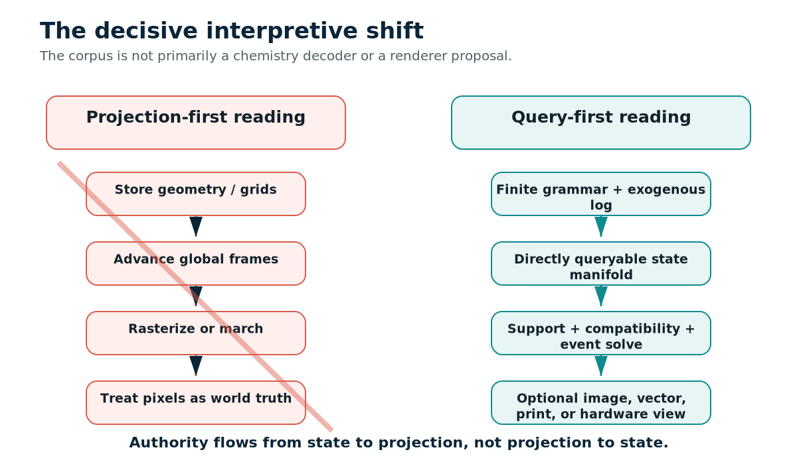
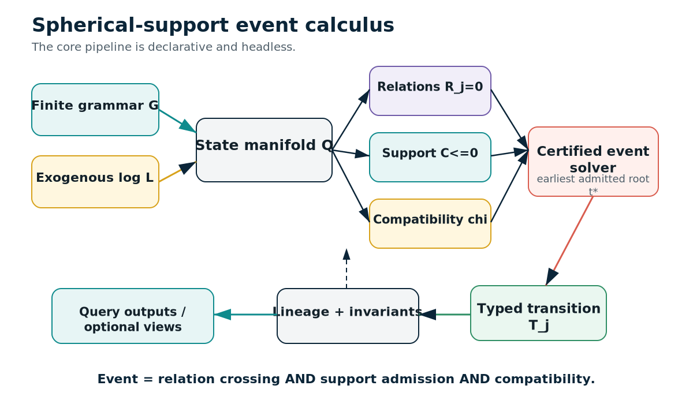
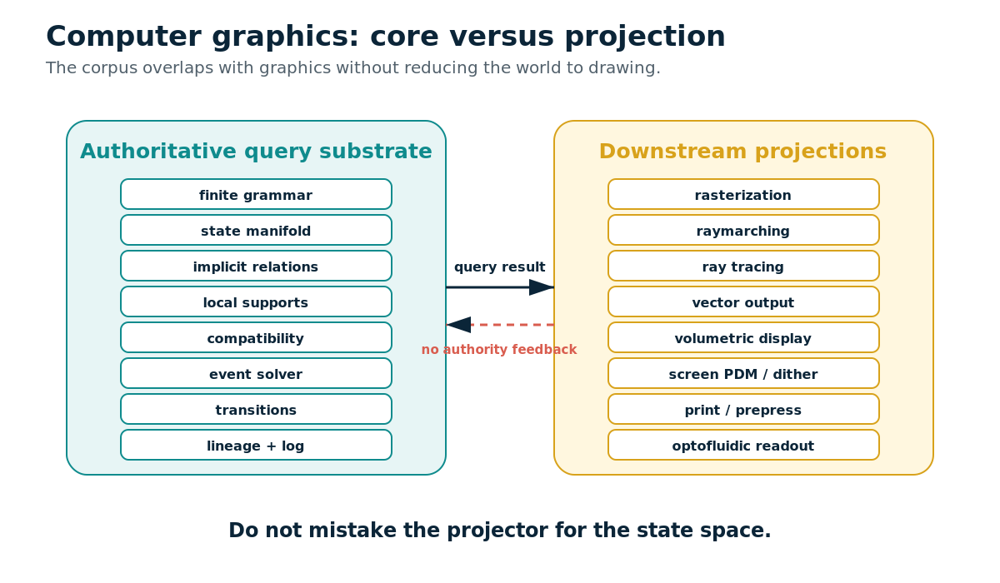
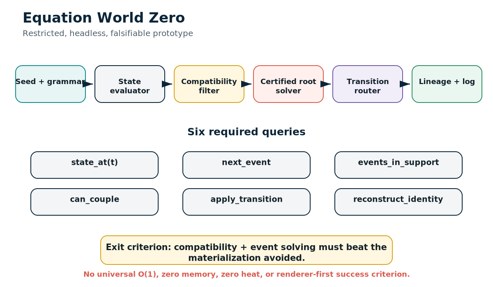

# Topological Cross-Domain Synthesis of the Spherical Substrate Corpus
**Information science, state-and-event calculus, topology, local spherical support, and the computer graphics boundary**
Version 2.0 - 14 August 2026
> This report supersedes the earlier chemistry-first reading. The corpus is treated primarily as a queryable topological/information architecture. No external performance validation was performed.
## Executive correction
The mature corpus is a **spherical-support event calculus**: a finite grammar generates a continuous state manifold; local radial-angular supports select relevance; compatibility controls whether co-located sectors couple; relation surfaces define events; typed transitions preserve invariants and lineage; images are optional downstream views. [S1 pp. 1, 5-7]

## Source authority
- **S1 - Chronological Synthesis of the Spherical Substrate Line(3).pdf:** Mature interpretive synthesis and feasibility discipline. Status: canonical interpretive authority.
- **S2 - hollowland-double-vacuum(7).pdf:** Generative topology and CS vocabulary: double vacuum, SDF zero, phase, parity, hourglass, eigenspace. Status: exploratory and metaphor-heavy.
- **S3 - dmt-spirit-molecule-(leeuwenhoek-animalcules-peter-the-great-netherlands-signify-phillips-netherlands) (1).pdf:** Optical/perceptual origin motifs: aperture, inversion, polar LUTs, sensory sieves, jitter, reflection. Status: exploratory cross-domain narrative.
- **S4 - 21BenBurgersStrikesBackTelNetNiet.pdf:** Zero-index, hinge, phi/D-fold, overlap and shared-domain motifs. Status: geometric/typographic brainstorming.
- **S5 - ADDominUS(1).pdf:** Cross-domain consolidation: relation algebra, identity, memory, compatibility, hardware prompts. Status: mixed synthesis with speculative claims.
- **S6 - Spherical_Throughput_Practical_Waveguide_Liquid_Substrate_Lensing(sqwit (super quick wit).pdf:** Bounded engineering translation, B.C.E. metrics, Hollowlens-0, failure criteria. Status: bounded implementation guide.
- **S7 - KC Vector Graphical Art System.pdf:** Downstream computer-graphics projection adapter: log-polar SDF, 1-bit modulation, jitter and prepress. Status: projection-layer proposal.

## Formal core
```text
Q = P^n x R_time x S^1_phase x Z2_sheet x A_address x B_branch
q_e(t) = (x_e(t), t, phi_e(t), sigma_e(t), a_e, b_e, p_e)
R_j(q;theta_j)=0
C_alpha(q,t)<=0
chi(e,j,t) in {0,1}
t* = min{t>=t0 : R_j(q_e(t))=0 AND C_alpha<=0 AND chi=1}
q_e(t*+) = T_j(q_e(t*-), context)
```
Double vacuum means same coordinate but different incompatible sector. One bit is a narrow parity/route flag. The hourglass is a routing visualization. Klein-bottle language is an explicit gluing/orientation abstraction only when a transfer map is supplied. [S1 pp. 5-7; S6 pp. 2, 5, 7, 10]

## Information-science normal form
- finite grammar -> generative program/schema
- relation algebra -> declarative constraints
- exogenous log -> event source for irreducible novelty
- lineage address -> provenance key
- phase sheet -> namespace/branch context
- compatibility -> join/access predicate
- projection -> materialized view
These right-hand terms are report-level correspondences, not always verbatim source terminology.
## Computer graphics boundary
Rasterization, raymarching, ray tracing, vector output, display modulation, and print are downstream projections. The distinction is query-versus-projection semantics, not sphere-versus-grid geometry. [S1 pp. 9-10]

## Equation World Zero
The included prototype implements closed-form state evaluation, analytic line/circle event roots, local support, compatibility, parity routing, lineage, and an append-only event log. It is deliberately restricted and falsifiable.

## Query matrix
| Query | Inputs | Operation | Output | Failure modes | Source |
|---|---|---|---|---|---|
| `state_at` | entity, time | Closed trajectory/grammar expression | State tuple q_e(t) | Expression size; branch history; conditioning | S1 pp.7-8,10-12 |
| `next_event` | entity, t0, relation family | Compatibility filter plus certified root solver | Earliest admitted event | Event density; multiple roots; tangency; degeneracy | S1 pp.7-8,11-12 |
| `events_in_support` | support, interval, policy | Analytic support pruning then relation evaluation | Ordered event set | Poor support/compatibility turns into broad scan | S1 pp.6-8,11 |
| `can_couple` | entity A, entity B, context | Sheet/phase/address/mode/policy predicate | Boolean plus reason code | Predicate design; semantic grounding | S1 p.6; S5 pp.32-33; S6 p.7 |
| `transition` | event, pre-state, context | Typed transition rule | Post-state, parity route, invariant check | Ambiguous or non-confluent rules | S1 pp.6-7; S6 p.7 |
| `reconstruct_identity` | seed, grammar path, log, branch | Lineage replay/reduction | Identity/provenance record | Split/merge collision; log incompleteness | S1 pp.8,11-12; S5 pp.7-11 |
| `project_view` | query result, camera/display policy | Downstream renderer or vector adapter | Image/vector/print output | Projection errors do not alter authoritative state | S1 pp.9-10; S7 pp.1-10 |
| `measure_throughput` | event log, time window, error boundary | Count verified B.C.E. events only | Theta_sph and benchmark vector | Miss/false events; energy boundary; calibration | S6 p.6 |

## Claims boundary
Retain direct queries, local support, compatibility, event guards, lineage, and typed transitions. Test horizon independence and novelty-proportional memory. Demote literal topology. Reject universal O(1), zero memory/heat/latency, physical immunity, and direct biological control.

## Full operator lexicon
| Term | Meaning | Formal role | Status | Source |
|---|---|---|---|---|
| State manifold | The product space that carries position, time, phase, sheet, lineage address, and branch. It is the authoritative state space, not an image buffer. | `Q = P^n x R_time x S^1_phase x Z2_sheet x A_address x B_branch` | canonical | S1 pp.5-6; S5 pp.1,9-11 |
| Finite grammar | A bounded generative rule set that produces closed dynamics and relation expressions instead of storing a complete object inventory. | `G` | canonical | S1 pp.5-7,11-12; S5 pp.10-11 |
| Relation algebra | Declarative equations or predicates that define possible states and transition surfaces. | `R_j(q;theta_j)=0` | canonical | S1 pp.1,5-7; S5 pp.1,9 |
| Event | A guard crossing that is admitted by support and compatibility. An event is not merely a geometric hit. | `t* = min{t >= t0 : R_j(q(t))=0 and C<=0 and chi=1}` | canonical | S1 pp.6-8; S6 pp.3,5,7 |
| Transition | The state update applied at an admitted event while preserving declared invariants and lineage. | `q(t*+) = T_j(q(t*-), context)` | canonical | S1 pp.6-7 |
| Invariant | A property that must persist across transitions, coordinate changes, or reconstruction. | `I` | canonical | S1 pp.1,5-7,11; S5 pp.7-11 |
| Exogenous log | A record of irreducible external novelty that cannot be regenerated from seed and grammar. | `L` | canonical | S1 pp.6,8,11-12; S5 pp.10-11 |
| Novelty-proportional memory | Memory discipline in which closed dynamics are regenerated and storage grows with external novelty and necessary branch history rather than geometric extent alone. | `M ~ seed + grammar + log + branch history` | bounded hypothesis | S1 pp.8,11-12; S5 pp.10-11 |
| Lineage | Persistent provenance through splits, merges, transitions, and coordinate changes. | `lineage(e)` | canonical | S1 pp.1,5-8,11; S5 pp.6-8,11 |
| Ontological address | A generative identity derived from seed, grammar path, and invariant history; normalized here as a provenance key rather than a literal magic UUID. | `a_e = H(seed,path,lineage)` | normalized operator | S1 pp.5-6; S5 pp.6-8 |
| Branch | A version, fork, or counterfactual path in the state evolution. Branch history is a real cost and can explode. | `b_e` | canonical | S1 pp.5-8,11 |
| State-at-time query | Direct evaluation of a closed state expression at time t without replaying every intermediate frame. Horizon independence is only plausible for fixed bounded expressions. | `state_at(e,t)` | canonical bounded claim | S1 pp.7-8,10-12 |
| Next-event query | Find the earliest compatible relation crossing after t0. Cost is compatibility plus root/event solving plus branch resolution. | `next_event(e,t0)` | canonical | S1 pp.7-8,10-12 |
| Events-in-support query | Enumerate admitted events inside a local radial-angular or causal support. | `events_in_support(C_alpha,t0,t1)` | canonical | S1 pp.6-7,11 |
| Compatibility predicate | A Boolean or typed predicate controlling whether co-located states, channels, or relations may couple. | `chi(e,j,t) in {0,1}` | canonical | S1 pp.6-8; S5 pp.13-16,32-33; S6 pp.3,5,7 |
| Local spherical support | A local chart for radial reach, angular support, orientation, field of view, uncertainty, or domain of dependence. It is not a global spherical remeshing. | `C_alpha(q,t)<=0` | canonical | S1 pp.1,5-7,9-10; S6 pp.3,6 |
| Cone | An analytic relevance, causal, sensing, collision, memory, or grammar support. It is not intrinsically a ray bundle. | `C_alpha` | canonical normalized operator | S1 pp.1,5-7,10; S2 pp.14-19 |
| Shell | A radial support boundary or nested relevance band around a local origin. | `r in [r0,r1]` | normalized operator | S1 pp.1,5-6 |
| SDF zero / B=0 | The explicit transition or guard surface where event semantics are invoked. It should not be confused with continuing to sample through an SDF. | `B(q)=0 or f(q)=0` | canonical | S1 pp.5-7; S2 pp.16-19; S5 p.54; S6 pp.3,5,7 |
| Signed distance field | An implicit scalar field that may define geometry or guards. In the mature reading it is evaluated as a relation; raymarching is optional downstream behavior. | `f(q)` | canonical with projection variant | S1 pp.7,9-10; S7 pp.1-2 |
| Double vacuum | Phase-separated co-location: two states may share spatial coordinates yet fail to interact because phase, sheet, orientation, address, or policy are incompatible. The second vacuum is absence of coupling. | `same x; chi=0` | canonical | S1 p.6; S2 pp.14-19; S5 pp.32-33; S6 pp.2,4 |
| Phase sheet | A sector or namespace that labels co-located states and participates in compatibility. | `sigma in Z2 or finite sheet set` | canonical | S1 pp.5-6; S5 pp.13-15,32-33 |
| One-bit parity | A narrow route, orientation, validity, freshness, or availability flag. It is not the full world state. | `p <- NOT p` | canonical narrow role | S1 pp.5-7; S5 pp.33,44-47,54; S6 pp.2,7 |
| Pinch point | A rank-changing event locus at the center of the hourglass routing visualization. It becomes meaningful only with an explicit guard and transition map. | `B=0` | normalized operator | S1 p.6; S2 pp.24-25; S5 pp.33,54 |
| Quad hourglass | A four-chamber routing partition with a central event locus and sheet/orientation transitions. It is a disciplined visualization, not a topology proof. | `four chambers + pinch` | normalized operator | S1 p.6; S2 pp.23-25; S5 pp.32-33,54 |
| Klein bottle | An orientation-reversing gluing or routing abstraction. A usable implementation must specify ports, transition functions, orientation map, and transfer matrix. | `quotient/gluing map` | demoted from literal physics | S1 pp.2,6; S2 pp.7-10,16-19; S6 pp.2,5,10 |
| Mobius strip | A one-sided continuity and inversion motif used in the optical/art narrative. It can motivate orientation reversal but is not required by the formal core. | `local orientation flip` | metaphorical / optional | S3 pp.5-10 |
| Phi: angular coordinate | The local angular coordinate or lighthouse incidence angle. Distinguish from phase schedule and golden ratio. | `phi_angle` | ambiguous source symbol | S2 pp.12-19; S5 pp.2-3 |
| Phi: phase law | A phase coordinate or schedule used in compatibility and coupling. Irrational schedules are presented as heuristics, not proven requirements. | `phi_phase(t)` | canonical concept, heuristic schedule | S1 pp.5-6; S2 pp.14-19; S5 pp.2-3 |
| Golden ratio | An optional scaling or phase motif in exploratory sources. The mature architecture does not require the golden ratio. | `phi_g=(1+sqrt(5))/2` | speculative motif | S2 pp.12-19; S4 pp.10-11 |
| Torque vector | The corrected interpretation in the Ben Burgers document for twisting or folding an oval/phi-like cross-section. Use tau, not phi, to avoid symbol collision. | `tau` | geometric brainstorming | S4 pp.11-14 |
| Eigenvector | An invariant direction under a transformation, used as an anchor or stable mode. | `A v = lambda v` | normalized operator | S2 pp.20-25; S5 pp.2,17,51 |
| Eigenvalue zero | A rank-loss or null-space event used metaphorically as an off-state. In an implementation it must be tied to a defined operator and numerical tolerance. | `lambda approx 0` | normalized with numerical guard | S2 pp.22-25; S5 pp.33,54 |
| Null space | The inactive or rejected subspace produced by a compatibility/kernel operation. It should mean algebraic exclusion, not physical disappearance. | `ker A` | normalized operator | S2 pp.22-25; S5 pp.15,33 |
| Overlap / weld zone | The slight overlap of folded D/phi shapes is read as intersection, tolerance buffer, constructive interference, or shared domain A intersect B. | `A intersect B` | metaphorical geometric operator | S4 pp.16-19 |
| Zero-based timeline | A reference-frame or indexing shift: an offset from index 0 identifies positions differently from 1-based counting. It does not change arithmetic. | `index 0` | corrected computing motif | S4 pp.1-6 |
| Rasterization | A downstream projection that maps stored or computed geometry into pixels. The corpus rejects using the raster as the authoritative world model. | `materialized image view` | downstream projection | S1 pp.1,9-10; S5 pp.1,9; S7 |
| Raymarching | Repeated field sampling along projected directions. It may visualize an SDF but is explicitly not the mature core. | `sample f along ray` | downstream / not core | S1 pp.1,7,9-10; S2 pp.12-17 |
| Ray tracing | Transport or visibility path computation. It can consume the substrate but does not define the substrate. | `path/visibility solver` | downstream projection | S1 pp.9-10 |
| Hybrid engine path | A bridge architecture with stable geometric/graph world state plus optional cone integration, volumetrics, raymarching, or display stages. | `core + projection stage` | supported bridge | S1 p.9 |
| Headless query-first path | The preferred experiment: algebra, compatibility, events, transitions, lineage, and logs before images. Success is not visual fidelity. | `query core` | canonical prototype path | S1 pp.9,11-12; S6 p.9 |
| Log-polar chart | A local coordinate transform rho=log r, theta=atan2(y,x). It supports radial multiscale addressing but introduces singularity and conditioning risks. | `rho=ln r; theta=atan2(y,x)` | projection/local chart | S2 pp.12-19; S3 pp.2-3; S7 pp.1,7 |
| 1-bit log-polar LUT | In exploratory sources this alternates between active-sector mask, parity field, and output quantizer. The report separates these roles rather than treating one bit as the whole state. | `mask(rho,theta)` | role-overloaded proposal | S2 pp.12-19; S7 pp.1-5 |
| Spherical LUT | A radial-angular lookup or local sensory organization. It should be read as a local chart/index, not proof that atoms or the whole world are spherical records. | `LUT(r,theta,phi)` | metaphorical/local support | S3 pp.14-20,24-33 |
| Sieve | A filter or candidate-reduction stage: aperture, receptor mosaic, BVH, octree, mask, or compatibility filter. The corpus aims to replace broad materialization with analytic support and compatibility, not prove all indexing unnecessary. | `filter/index` | normalized caution | S3 pp.13-15,24-33; S5 pp.14-16; S2 pp.30-32 |
| Jitter / micro-saccade | Controlled perturbation used to fill sampling gaps, dither quantization, or estimate sub-cell structure. It belongs to sensors and projections, not the invariant core. | `epsilon(t)` | projection/sensing operator | S3 pp.13-15,24-33; S7 pp.8-10 |
| Feynman vector | The KC document uses this name for phase-amplitude vectors integrated near SDF boundaries. No formal path-integral derivation is supplied, so this report renames it a phase-amplitude edge accumulator. | `A(p)=sum_k a_k exp(i phi_k)` | speculative / renamed for clarity | S7 pp.1-3 |
| Phase-amplitude edge accumulator | A source-faithful normalization of the KC Feynman-vector idea: accumulate weighted phase samples near an implicit boundary, then quantize for output. | `A(p)` | decoder inference | S7 pp.1-3 |
| Pulse-density modulation | A temporal 1-bit stream whose pulse density represents intensity. It is a possible output adapter for a physical display, not the state substrate. | `PDM` | projection-layer proposal | S7 pp.4-6 |
| Anisotropic dithering | Log-radius- and angle-aware stochastic quantization used for screen or print output. | `blue-noise threshold` | projection-layer proposal | S7 pp.5,8-10 |
| Prepress adapter | A static 1-bit halftone path: CMYK mapping, log-polar blue noise, SDF edge lock, and dot-gain compensation. | `1-bit TIFF/PDF` | projection-layer proposal | S7 pp.8-10 |
| Materialized view | A rendered image, mesh, cache, or sampled field derived from the authoritative relation/event state. This term is the report's information-science translation. | `view(Q,query)` | decoder inference | S1 pp.1,9-10; S5 p.9 |
| B.C.E. | Bounded Compatibility Event: support admitted, channel compatible, guard crossed, and confidence threshold met. | `support and chi and g=0` | canonical bounded operator | S6 pp.1,3,5,7 |
| Spherical throughput | Verified compatible events or answered queries per second at a declared error budget, not raw photon flux or propagation speed. | `Theta_sph=N_verified/Delta t` | canonical metric | S6 pp.3,6,11 |
| Matrix-in-glass | A calibrated passive or tunable optical transfer matrix in a waveguide mesh. It is not a stored picture or zero-energy computer. | `optical transfer matrix` | bounded hardware translation | S5 pp.47-50; S6 pp.2,5 |
| Liquid substrate | A liquid lens, overclad, or core coupled to a solid photonic substrate to tune focus, effective index, phase, or mode coupling. | `n_eff(u)` | bounded hardware translation | S5 pp.58-64; S6 pp.2-5,8 |
| Hollowlens-0 | A minimum optofluidic demonstrator: scanned input, tunable liquid coupler, 2x2 interferometer, balanced detectors, digital sidecar, and pre-registered event tests. | `prototype stack` | canonical prototype | S6 pp.4,7-10 |
| Digital sidecar | Conventional electronics for calibration, thresholds, uncertainty, lineage, policy, drift detection, and fallback. Its necessity prevents magical zero-latency claims. | `FPGA/MCU` | canonical control element | S6 pp.4,7-10 |
| Type safety | Keep electromagnetics, fluid mechanics, coupled-mode theory, event logic, topology, and information semantics in their own domains with explicit interfaces. | `domain separation` | canonical engineering discipline | S6 pp.2,5 |
| Equation World Zero | Restricted headless prototype with low-dimensional homogeneous coordinates, continuous time, two sheets, one orientation bit, bounded relation families, finite grammar depth, lineage, and symbolic outputs. | `EW0` | canonical prototype | S1 pp.7,11-12 |
| Universal O(1) | The mature sources reject a universal constant-cost universe. Only fixed closed expressions may have horizon-independent state evaluation. | `not accepted` | rejected totalizing claim | S1 pp.1,8; S6 p.10 |
| Zero memory / heat / latency | Rejected as system claims. Storage, branch history, optical sources, actuation, detection, calibration, and control all carry costs. | `not accepted` | rejected totalizing claim | S1 pp.1,8; S6 pp.2,10 |
| Biological or medical control | The corpus contains analogies and application prompts, but the bounded engineering report explicitly makes no general biological or medical mechanism claim. | `not established` | excluded from technical core | S5 pp.3-6; S6 p.10 |

## Claim matrix
| ID | Claim | Evidence | Disposition | Source |
|---|---|---|---|---|
| C01 | The authoritative object is a directly queryable relation/state/event substrate rather than an image or frame buffer. | canonical | retain | S1 pp.1,5-10; S5 pp.1,9 |
| C02 | Local spherical or radial-angular supports organize relevance, coupling, sensing, and measurement. | canonical | retain | S1 pp.1,5-7; S6 pp.3,6 |
| C03 | A finite grammar plus relations, transitions, invariants, and an exogenous log can define a restricted equation world. | canonical architecture | retain | S1 pp.5-8,11-12; S5 pp.10-11 |
| C04 | SDF=0 or B=0 is best read as an event/transition surface, not a place to keep marching through. | canonical correction | retain | S1 p.7; S2 pp.16-19; S5 p.54 |
| C05 | Events require relation satisfaction, support admission, and compatibility. | canonical | retain | S1 pp.6-8; S6 pp.3,5,7 |
| C06 | Double vacuum means co-location without coupling across incompatible phase/sheet/address sectors. | canonical | retain | S1 p.6; S5 pp.32-33; S6 pp.2,4 |
| C07 | One bit is a routing/parity/validity flag, not the complete state. | canonical correction | retain | S1 pp.5-7; S6 pp.2,7 |
| C08 | Identity should persist by lineage and invariants rather than current coordinate alone. | canonical | retain | S1 pp.1,5-8,11; S5 pp.6-8 |
| C09 | Closed dynamics can be regenerated from seed and grammar, while irreducible novelty is logged. | architecture hypothesis | prototype | S1 pp.8,11-12; S5 pp.10-11 |
| C10 | For a fixed closed expression, state_at(t) cost may be independent of skipped timesteps. | bounded complexity claim | test | S1 p.8 |
| C11 | next_event can replace frame replay when compatible event roots are tractable. | bounded complexity claim | test | S1 pp.7-8,11-12 |
| C12 | Compatibility plus event solving must cost less than the materialization avoided. | canonical success criterion | retain | S1 p.8; S6 p.6 |
| C13 | Rasterization, raymarching, and ray tracing may remain downstream projections. | canonical | retain | S1 pp.9-10; S5 p.9 |
| C14 | The KC Vector system can be interpreted as a downstream projection adapter over log-polar addresses and implicit boundaries. | projection proposal | retain with caveat | S7 pp.1-10 |
| C15 | KC Feynman vectors are a fully specified quantum path-integral method. | unsupported terminology | rename/demote | S7 pp.1-3 |
| C16 | A log-polar chart turns radial scaling into additive translation in log radius. | source-defined mathematical observation | retain | S7 p.7; S3 pp.2-3 |
| C17 | Sieve and jitter motifs describe sensor sampling, dithering, and candidate reduction. | cross-domain analogy | retain as layer-specific | S3 pp.13-15,24-33; S7 pp.8-10 |
| C18 | All spatial sieves, BVHs, octrees, and broad phases are eliminated universally. | inflated claim | demote/test | S2 pp.30-32; S5 pp.14-16 |
| C19 | Klein bottle topology is a useful routing/gluing abstraction. | bounded abstraction | retain | S1 p.6; S6 pp.2,5 |
| C20 | A literal Klein-bottle device automatically prevents tunneling or physical interaction. | unsupported physical claim | reject | S2 pp.16-25; S5 pp.35,64 |
| C21 | The quad hourglass is a four-sector routing visualization around a rank-changing event locus. | normalized interpretation | retain | S1 p.6; S2 pp.23-25; S5 pp.33,54 |
| C22 | lambda=0 may mark rank loss/null-space entry at an event. | normalized mathematical motif | retain with tolerance | S2 pp.22-25; S5 pp.33,54 |
| C23 | The golden ratio is required for correctness or loop avoidance. | speculative motif | reject as requirement | S2 pp.12-19; S4 pp.10-11 |
| C24 | Phi is used consistently across the corpus. | false due to symbol overload | correct | S2; S4; S5 |
| C25 | The Ben Burgers overlap can be read as shared domain, interference, or tolerance. | geometric brainstorming | retain as analogy | S4 pp.16-19 |
| C26 | Zero-based indexing changes 21+7+7 from 35 to 36. | incorrect if read as arithmetic | correct | S4 pp.1-3 |
| C27 | Hollowlens-0 is a bounded optofluidic demonstrator with a digital sidecar. | canonical prototype | retain | S6 pp.4,7-10 |
| C28 | Matrix-in-glass is a calibrated optical transfer function. | bounded hardware translation | retain | S6 pp.2,5 |
| C29 | Double vacuum in hardware can be implemented as uncoupled or isolated modes/channels. | bounded hardware translation | retain | S6 pp.2,4 |
| C30 | Spherical throughput is verified events per second with support, compatibility, guard and confidence. | canonical metric | retain | S6 pp.3,6,11 |
| C31 | The integrated optical system has proven an advantage over matched electronics. | not established | test | S6 pp.9-12 |
| C32 | The architecture has zero latency, zero heat, zero power, or zero memory. | explicitly rejected totalizing claim | reject | S2 pp.15,26-35; S5 multiple; S6 pp.2,10 |
| C33 | The architecture universally solves chaos or all PDEs exactly. | explicitly rejected totalizing claim | reject | S2; S5; S6 p.10 |
| C34 | The architecture directly controls biology, gene expression, CRISPR, protein folding, or medical outcomes. | unsupported application claim | exclude | S5 pp.3-6; S6 p.10 |
| C35 | Political, psychological, and personal narratives in later source pages are technical proof. | metaphorical narrative | exclude from core | S3 later pages; S5 pp.13-35 |
| C36 | A person or identity can become physically untouchable through phase sheets or UUIDs. | unsupported literal claim | reject | S5 pp.14-18,32-35 |
| C37 | The headless query-first prototype is the truest first experiment. | canonical recommendation | retain | S1 pp.9,11-12; S6 p.9 |
| C38 | A hybrid engine remains a practical bridge. | supported engineering bridge | retain | S1 p.9 |
| C39 | Numerical conditioning is part of the ontology, not an implementation afterthought. | canonical risk | retain | S1 pp.8-9 |
| C40 | The first useful benchmark is six queries: state, next event, events in cone, phase coupling, transition routing, identity rebuild. | canonical experiment plan | retain | S1 pp.11-12 |

## Package contents
See `README.md`, `data/`, `specs/`, `prototype/`, `diagrams/`, `source_maps/`, `source_extracts/`, and `source_documents/`.
